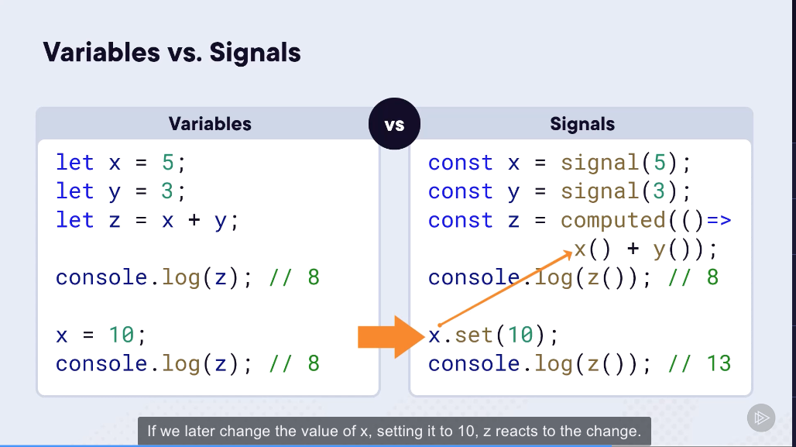
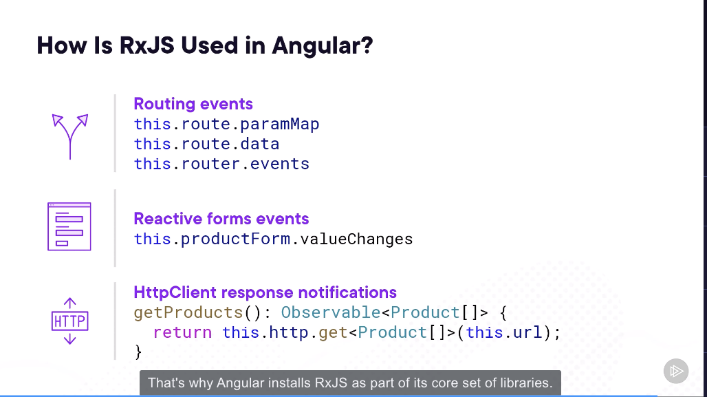
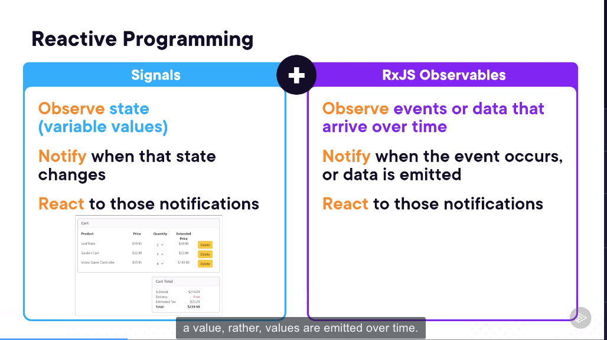
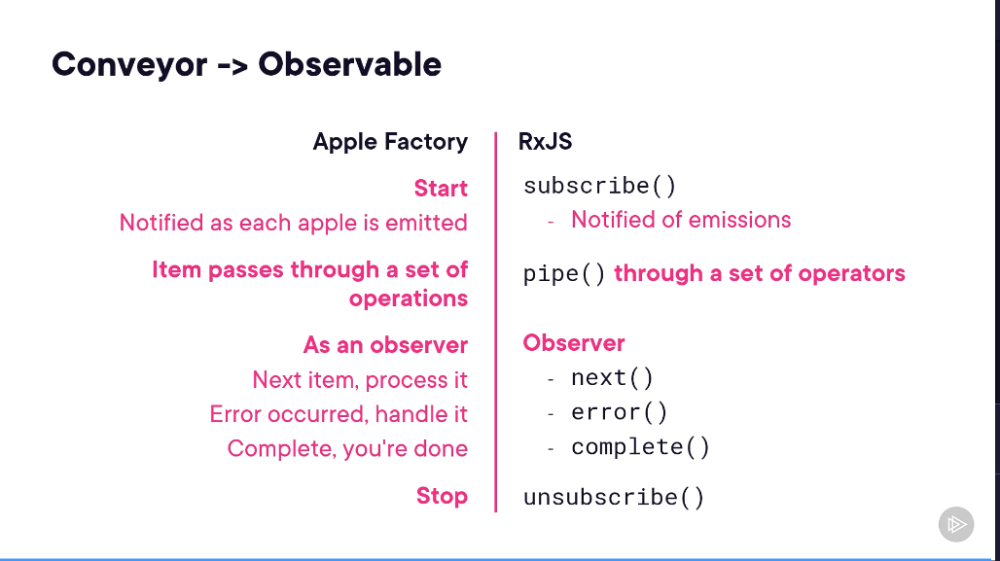

# RxJS and Angular Signals Fundamentals by Deborah Kurata

##  Warning

* Kurs sonunda burada yazılan kodları ilgili bölümlere aktarıp kalıcı hale getir.

##  Notes for Module 1

* RxJS : Reactive programming
* Subjects : Reacting to user actions
* Signals : State management and change detection

##  Notes for Module 2

###  Reactive programming

```shell
x + y = z
x = 3
y = 5
z = 8
```

x is set to 10
z is still 8

With signals



I put a [console component](/Users/bulent/git-repos/temp/lc-pluralsight-angular-001/project1/src/app/console/console.component.ts) and implementation for variables vs signals.

1. Keyboard is the source.
2. Key pressed, an event occurs
3. Observable observes the event.
4. Observable emit a notification with a resulting value.
5. Before emitting the value an observer can process data with operators
6. Subscriber subscribe to observable to receive notifications.

### How is RxJS is used in angular?



###  RxJS vs Signals



##  Notes for Module 3

### Observable

An observable is created from an event or a data source

- Conveyor->Observable



- Observables can emit


- Sync/Async


###  Sample-1

/Users/bulent/git-repos/temp/lc-pluralsight-angular-001/observable-sample-1

First time for using the ".mjs" extension.


### Subscription

### Observer

### Observable Creation Function
