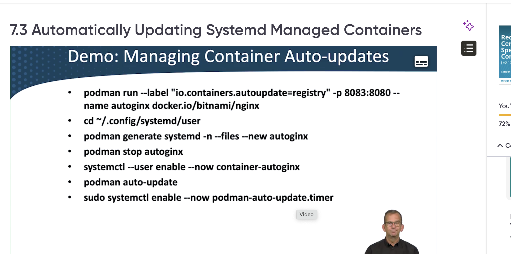

# Podman generate systemd

Podman has built-in systemd integration:

```bash
# Run a container first
podman run -d --name my-app nginx

# Generate systemd unit files
podman generate systemd --new --files --name my-app

# Move the generated file to the right location
limactl shell podman

sudo cp container-my-app.service /etc/systemd/system/
# Or for user services:
mkdir -p ~/.config/systemd/user
cp container-my-app.service ~/.config/systemd/user/

# Enable and start
systemctl --user daemon-reload
systemctl --user enable --now container-my-app.service
```

## Checking the service status

```shell
# List user services for current user
systemctl --user list-units --type=service

# List user services for a specific user (run as that user)
sudo su - anna
systemctl --user list-units --type=service

# Check status of user service
systemctl --user status my-container.service

# List all user unit files
systemctl --user list-unit-files --type=service
```

## Stopping and disabling the service

```shell
# Stop the service
systemctl --user stop container-my-app.service
# Disable the service
systemctl --user disable container-my-app.service
# Reload systemd to apply changes
systemctl --user daemon-reload
# Check status again
systemctl --user status container-my-app.service
```


```shell
# Remove from user's config directory
rm ~/.config/systemd/user/container-my-app.service
# Reload daemon
systemctl --user daemon-reload
```

## Another example

```bash
# Move the generated file to the right location
limactl shell podman
podman run -d --label "io.containers.autoupdate=registry" -p 8083:8080 --name autonginx docker.io/bitnami/nginx
cd  ~/.config/systemd/user/
podman generate systemd --new --files --name autonginx
# Enable and start
systemctl --user daemon-reload
systemctl --user enable --now container-autonginx.service
```

