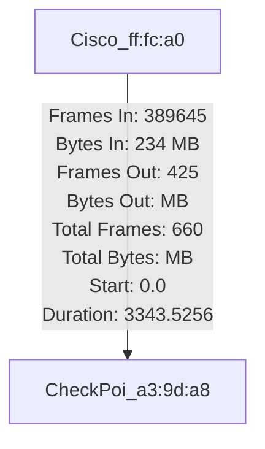
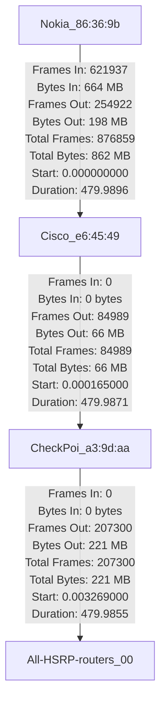
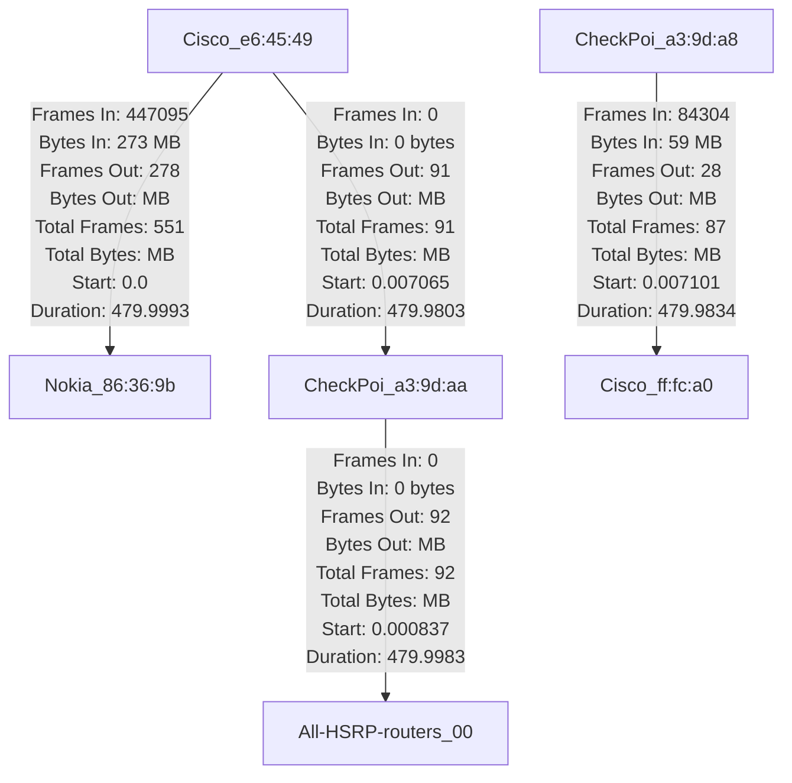
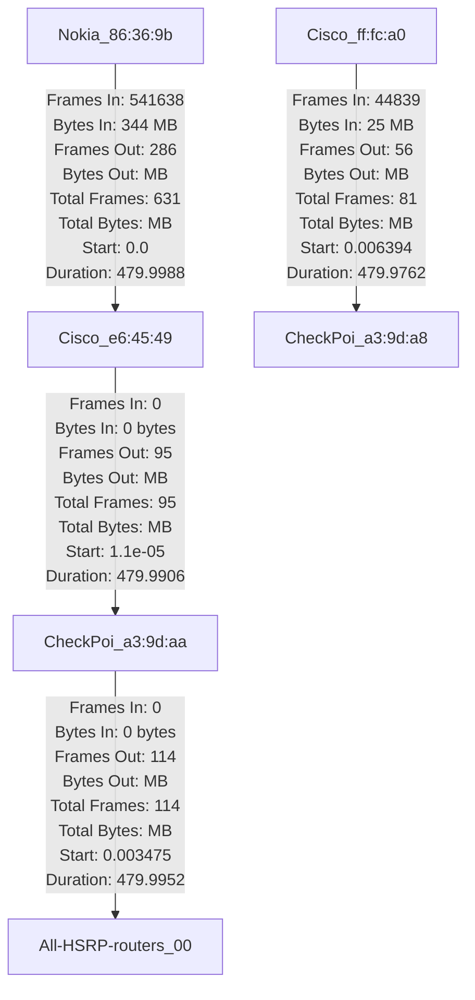
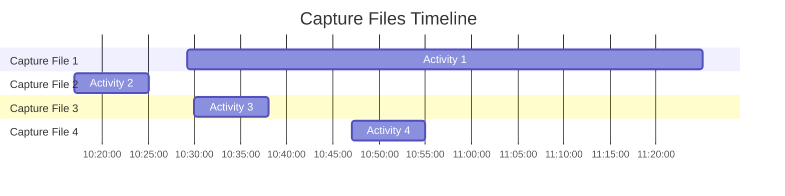

# 20230925 Scapy, Public API's

## Public API's

<https://github.com/public-apis/public-apis>

##  Scapy

```console
p1 = IP(dst="8.8.8.8")/TCP(flags="F")
sr(p1)

p2 = IP(dst="8.8.8.8")/TCP(flags="S")
sr(p2)

p3 = IP(dst="www.btegitim.com")/TCP(flags="S")
sr(p3)
```


## Tshark

### Finding ethernet conversations with tshark and awk

```shell
tshark -r 10.8.94.17-any\ 18-04-2023------10-28_11-25.pcap -T fields -e eth.src -e eth.dst | awk '{ if ($1 < $2) print $1, $2; else print $2, $1; }' | sort -u | awk '{print "{ \"src\": \"" $1 "\", \"dst\": \"" $2 "\" }"}'
```

```shell
bulent@Bulents-MacBook-Pro-M1 helios-compare/captures %
> tshark -r 10.8.94.17-any\ 18-04-2023------10-28_11-25.pcap -qz conv,"eth"
================================================================================
Ethernet Conversations
Filter:<No Filter>
                                               |       <-      | |       ->      | |     Total     |    Relative    |   Duration   |
                                               | Frames  Bytes | | Frames  Bytes | | Frames  Bytes |      Start     |              |
Cisco_ff:fc:a0       <-> CheckPoi_a3:9d:a8     389645 234 MB     619112 425 MB     1008757 660 MB        0.000000000      3343.5256
================================================================================
```

```shell
bulent@Bulents-MacBook-Pro-M1 helios-compare/captures %
> eth-conv.sh 10.8.94.17-any\ 18-04-2023------10-28_11-25.pcap
{ "src": "00:08:e3:ff:fc:a0", "dst": "00:1c:7f:a3:9d:a8", "count": 1008757 }
bulent@Bulents-MacBook-Pro-M1 helios-compare/captures %
> eth-conv.sh 149.137.9.230-any\ 18_04_2023--10_17-10_25.pcap
{ "src": "00:00:0c:07:ac:00", "dst": "00:1c:7f:a3:9d:aa", "count": 207300 }
{ "src": "00:42:68:e6:45:49", "dst": "e4:81:84:86:36:9b", "count": 876859 }
{ "src": "00:1c:7f:a3:9d:aa", "dst": "00:42:68:e6:45:49", "count": 84989 }
bulent@Bulents-MacBook-Pro-M1 helios-compare/captures %
> eth-conv.sh 149.137.9.230-any\ 18_04_2023--10_30-10_38.pcap
{ "src": "00:00:0c:07:ac:00", "dst": "00:1c:7f:a3:9d:aa", "count": 159161 }
{ "src": "00:42:68:e6:45:49", "dst": "e4:81:84:86:36:9b", "count": 924558 }
{ "src": "00:1c:7f:a3:9d:aa", "dst": "00:42:68:e6:45:49", "count": 149020 }
{ "src": "00:08:e3:ff:fc:a0", "dst": "00:1c:7f:a3:9d:a8", "count": 134096 }
bulent@Bulents-MacBook-Pro-M1 helios-compare/captures %
> eth-conv.sh 149.137.9.230-any\ 18_04_2023--10_47-10_55.pcap
{ "src": "00:00:0c:07:ac:00", "dst": "00:1c:7f:a3:9d:aa", "count": 180551 }
{ "src": "00:42:68:e6:45:49", "dst": "e4:81:84:86:36:9b", "count": 1022558 }
{ "src": "00:1c:7f:a3:9d:aa", "dst": "00:42:68:e6:45:49", "count": 160318 }
{ "src": "00:08:e3:ff:fc:a0", "dst": "00:1c:7f:a3:9d:a8", "count": 126900 }
```

```shell title="eth-con.sh"
#!/bin/bash

if [ "$#" -ne 1 ]; then
    echo "Usage: $0 <file.pcap>"
    exit 1
fi

if [ ! -f "$1" ]; then
    echo "Error: $1 is not a file."
    exit 1
fi

tshark -r "$1" -T fields -e eth.src -e eth.dst | \
gawk '{
    key = ($1 < $2 ? $1 "," $2 : $2 "," $1); # Use a comma as separator
    arr[key]++;
}
END {
    for (key in arr) {
        n = split(key, macs, ","); # Split using a comma as separator
        print "{ \"src\": \"" macs[1] "\", \"dst\": \"" macs[2] "\", \"count\": " arr[key] " }";
    }
}'
```

#### Diagrams of the captures 1/4

```shell


> tshark -r captures/10.8.94.17-any\ 18-04-2023------10-28_11-25.pcap -qz conv,"eth" | ./eth-conversation-w-tshark.py
[
    {
        "source": "Cisco_ff:fc:a0",
        "destination": "CheckPoi_a3:9d:a8",
        "in": {
            "frames": 389645,
            "bytes": "234 MB     619112"
        },
        "out": {
            "frames": 425,
            "bytes": "MB     1008757"
        },
        "total": {
            "frames": 660,
            "bytes": "MB"
        },
        "start": 0.0,
        "duration": 3343.5256
    }
]
```

[Mermaid Live Editor](https://mermaid.live)

##### 10.8.94.17-any 18-04-2023------10-28_11-25.pcap



??? Capinfos

    ```shell
    > capinfos 10.8.94.17-any\ 18-04-2023------10-28_11-25.pcap
    File name:           10.8.94.17-any 18-04-2023------10-28_11-25.pcap
    File type:           Wireshark/tcpdump/... - pcap
    File encapsulation:  Ethernet
    File timestamp precision:  microseconds (6)
    Packet size limit:   file hdr: 65535 bytes
    Packet size limit:   inferred: 300 bytes
    Number of packets:   1008 k
    File size:           277 MB
    Data size:           660 MB
    Capture duration:    3343.525605 seconds
    First packet time:   2023-04-18 10:29:16.468257
    Last packet time:    2023-04-18 11:24:59.993862
    Data byte rate:      197 kBps
    Data bit rate:       1580 kbps
    Average packet size: 654.87 bytes
    Average packet rate: 301 packets/s
    SHA256:              25bc2fdf41504ab199deb9f4d946fa9cd0bf55fa2eb4e4694b2a3cc54567f88d
    RIPEMD160:           4d6733b7c6dee083a11ffef03c5c1a7d56b2e2c1
    SHA1:                f4544af6dcb771c37d749bdd120efa4bcc43b1a2
    Strict time order:   True
    Number of interfaces in file: 1
    Interface #0 info:
                        Encapsulation = Ethernet (1 - ether)
                        Capture length = 65535
                        Time precision = microseconds (6)
                        Time ticks per second = 1000000
                        Number of stat entries = 0
                        Number of packets = 1008757
    ```


??? Python Source Code

    ```python

    #!/usr/bin/env python3
    # eth-conversation-w-tshark.py

    import sys
    import re
    import json

    # Read the input data from stdin
    data = sys.stdin.read()

    # Extract the lines containing the relevant data
    lines = data.strip().split('\n')[4:]

    # Initialize an empty list to store the conversation data
    conversations = []

    for line in lines:
        # Extracting the relevant fields using regular expressions
        # match = re.match(r"([\w\d_:]+)\s+<->\s+([\w\d_:]+)\s+(\d+)\s+([\w\s]+)\s+(\d+)\s+([\w\s]+)\s+(\d+)\s+([\w\s]+)\s+([\d.]+)\s+([\d.]+)", line)
        match = re.match(r"([-\w\d_:]+)\s+<->\s+([-\w\d_:]+)\s+(\d+)\s+([\w\s]+)\s+(\d+)\s+([\w\s]+)\s+(\d+)\s+([\w\s]+)\s+([\d.]+)\s+([\d.]+)", line)

        if match:
            src, dest, frames_in, bytes_in, frames_out, bytes_out, frames_total, bytes_total, start, duration = match.groups()
            
            conversation = {
                "source": src,
                "destination": dest,
                "in": {
                    "frames": int(frames_in),
                    "bytes": bytes_in.strip()
                },
                "out": {
                    "frames": int(frames_out),
                    "bytes": bytes_out.strip()
                },
                "total": {
                    "frames": int(frames_total),
                    "bytes": bytes_total.strip()
                },
                "start": float(start),
                "duration": float(duration)
            }
            
            conversations.append(conversation)

    # Converting the list of conversations to a JSON string
    json_output = json.dumps(conversations, indent=4)
    print(json_output)

    ```

#### Diagrams of the captures 2/4

```shell
> tshark -r 149.137.9.230-any\ 18_04_2023--10_17-10_25.pcap -qz conv,"eth" | ../eth-conversation-w-tshark.py
[
    {
        "source": "Nokia_86:36:9b",
        "destination": "Cisco_e6:45:49",
        "in": {
            "frames": 621937,
            "bytes": "664 MB     254922"
        },
        "out": {
            "frames": 198,
            "bytes": "MB     876859"
        },
        "total": {
            "frames": 862,
            "bytes": "MB"
        },
        "start": 0.0,
        "duration": 479.9896
    },
    {
        "source": "CheckPoi_a3:9d:aa",
        "destination": "All-HSRP-routers_00",
        "in": {
            "frames": 0,
            "bytes": "0 bytes    207300"
        },
        "out": {
            "frames": 221,
            "bytes": "MB     207300"
        },
        "total": {
            "frames": 221,
            "bytes": "MB"
        },
        "start": 0.003269,
        "duration": 479.9855
    },
    {
        "source": "Cisco_e6:45:49",
        "destination": "CheckPoi_a3:9d:aa",
        "in": {
            "frames": 0,
            "bytes": "0 bytes     84989"
        },
        "out": {
            "frames": 66,
            "bytes": "MB       84989"
        },
        "total": {
            "frames": 66,
            "bytes": "MB"
        },
        "start": 0.000165,
        "duration": 479.9871
    }
]
```

##### 149.137.9.230-any\ 18_04_2023--10_17-10_25.pcap



??? Capinfos
    ```shell
    > capinfos 149.137.9.230-any\ 18_04_2023--10_17-10_25.pcap
    File name:           149.137.9.230-any 18_04_2023--10_17-10_25.pcap
    File type:           Wireshark/tcpdump/... - pcap
    File encapsulation:  Ethernet
    File timestamp precision:  microseconds (6)
    Packet size limit:   file hdr: 65535 bytes
    Packet size limit:   inferred: 300 bytes
    Number of packets:   1169 k
    File size:           335 MB
    Data size:           1150 MB
    Capture duration:    479.989612 seconds
    First packet time:   2023-04-18 10:17:00.010345
    Last packet time:    2023-04-18 10:24:59.999957
    Data byte rate:      2396 kBps
    Data bit rate:       19 Mbps
    Average packet size: 983.78 bytes
    Average packet rate: 2435 packets/s
    SHA256:              2c9d1d8ceff3e6baf768ce26338e4601cde8db90eed73d11faa37c71856a98a4
    RIPEMD160:           2da14073841695f6d16c12ca008693c4dd51416b
    SHA1:                2df048e483a1f2e3f771b4aa98642840da2b7cde
    Strict time order:   True
    Number of interfaces in file: 1
    Interface #0 info:
                        Encapsulation = Ethernet (1 - ether)
                        Capture length = 65535
                        Time precision = microseconds (6)
                        Time ticks per second = 1000000
                        Number of stat entries = 0
                        Number of packets = 1169148
    ```

#### Diagrams of the captures 3/4

##### 149.137.9.230-any\ 18_04_2023--10_30-10_38.pcap

```shell
tshark -r 149.137.9.230-any\ 18_04_2023--10_30-10_38.pcap -qz conv,"eth" | ../eth-conversation-w-tshark.py

```



??? Capinfos 
    ```shell
    > capinfos 149.137.9.230-any\ 18_04_2023--10_30-10_38.pcap
    File name:           149.137.9.230-any 18_04_2023--10_30-10_38.pcap
    File type:           Wireshark/tcpdump/... - pcap
    File encapsulation:  Ethernet
    File timestamp precision:  microseconds (6)
    Packet size limit:   file hdr: 65535 bytes
    Packet size limit:   inferred: 300 bytes
    Number of packets:   1366 k
    File size:           346 MB
    Data size:           823 MB
    Capture duration:    479.999261 seconds
    First packet time:   2023-04-18 10:30:00.000137
    Last packet time:    2023-04-18 10:37:59.999398
    Data byte rate:      1715 kBps
    Data bit rate:       13 Mbps
    Average packet size: 602.37 bytes
    Average packet rate: 2847 packets/s
    SHA256:              64ca6813d9cd7aeedfe2fd01dc7a12f579ff5271e2a75387d4aced062b48589b
    RIPEMD160:           0965ee3135d5eb4a6365dac790707cde35f04bef
    SHA1:                855673a1a57e222d7a37eefbad3c92a699aa243b
    Strict time order:   True
    Number of interfaces in file: 1
    Interface #0 info:
                         Encapsulation = Ethernet (1 - ether)
                         Capture length = 65535
                         Time precision = microseconds (6)
                         Time ticks per second = 1000000
                         Number of stat entries = 0
                         Number of packets = 1366835
    ```

####  Diagrams of the captures 4/4

##### 149.137.9.230-any 18_04_2023--10_47-10_55.pcap

```shell
> tshark -r 149.137.9.230-any\ 18_04_2023--10_47-10_55.pcap -qz conv,"eth" | ../eth-conversation-w-tshark.py

```

```json


[
    {
        "source": "Nokia_86:36:9b",
        "destination": "Cisco_e6:45:49",
        "in": {
            "frames": 541638,
            "bytes": "344 MB     480920"
        },
        "out": {
            "frames": 286,
            "bytes": "MB     1022558"
        },
        "total": {
            "frames": 631,
            "bytes": "MB"
        },
        "start": 0.0,
        "duration": 479.9988
    },
    {
        "source": "CheckPoi_a3:9d:aa",
        "destination": "All-HSRP-routers_00",
        "in": {
            "frames": 0,
            "bytes": "0 bytes    180551"
        },
        "out": {
            "frames": 114,
            "bytes": "MB     180551"
        },
        "total": {
            "frames": 114,
            "bytes": "MB"
        },
        "start": 0.003475,
        "duration": 479.9952
    },
    {
        "source": "Cisco_e6:45:49",
        "destination": "CheckPoi_a3:9d:aa",
        "in": {
            "frames": 0,
            "bytes": "0 bytes    160318"
        },
        "out": {
            "frames": 95,
            "bytes": "MB      160318"
        },
        "total": {
            "frames": 95,
            "bytes": "MB"
        },
        "start": 1.1e-05,
        "duration": 479.9906
    },
    {
        "source": "Cisco_ff:fc:a0",
        "destination": "CheckPoi_a3:9d:a8",
        "in": {
            "frames": 44839,
            "bytes": "25 MB       82061"
        },
        "out": {
            "frames": 56,
            "bytes": "MB      126900"
        },
        "total": {
            "frames": 81,
            "bytes": "MB"
        },
        "start": 0.006394,
        "duration": 479.9762
    }
]

```




??? Capinfos

    ```shell
    > capinfos 149.137.9.230-any\ 18_04_2023--10_47-10_55.pcap
    File name:           149.137.9.230-any 18_04_2023--10_47-10_55.pcap
    File type:           Wireshark/tcpdump/... - pcap
    File encapsulation:  Ethernet
    File timestamp precision:  microseconds (6)
    Packet size limit:   file hdr: 65535 bytes
    Packet size limit:   inferred: 300 bytes
    Number of packets:   1490 k
    File size:           372 MB
    Data size:           923 MB
    Capture duration:    479.998802 seconds
    First packet time:   2023-04-18 10:47:00.000008
    Last packet time:    2023-04-18 10:54:59.998810
    Data byte rate:      1923 kBps
    Data bit rate:       15 Mbps
    Average packet size: 619.59 bytes
    Average packet rate: 3104 packets/s
    SHA256:              180e06877a7ebc84b7b7cd7d54f63b5867fd9197bb60e85d77ab0d66c058b6ef
    RIPEMD160:           37325df6f50a386991766f2130e336a7fe1ce603
    SHA1:                da28f5b52f0ca333ae0c87bd547f1c3b6e17136f
    Strict time order:   True
    Number of interfaces in file: 1
    Interface #0 info:
                        Encapsulation = Ethernet (1 - ether)
                        Capture length = 65535
                        Time precision = microseconds (6)
                        Time ticks per second = 1000000
                        Number of stat entries = 0
                        Number of packets = 1490327

    ```

```shell title="Raw Data"

Capture File 1

Capture duration:    3343.525605 seconds
First packet time:   2023-04-18 10:29:16.468257
Last packet time:    2023-04-18 11:24:59.993862

Capture File 2

Capture duration:    479.989612 seconds
First packet time:   2023-04-18 10:17:00.010345
Last packet time:    2023-04-18 10:24:59.999957

Capture File 3

Capture duration:    479.999261 seconds
First packet time:   2023-04-18 10:30:00.000137
Last packet time:    2023-04-18 10:37:59.999398

Capture File 4 

Capture duration:    479.998802 seconds
First packet time:   2023-04-18 10:47:00.000008
Last packet time:    2023-04-18 10:54:59.998810

```

