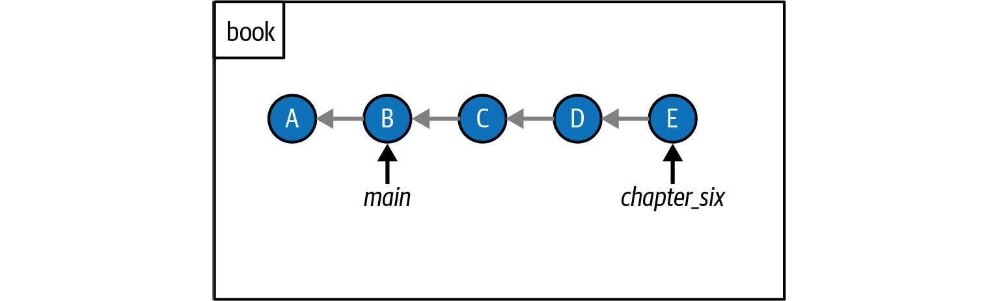

# 20231012 Git

## Git

### Parent Item

```shell
bulent@Bulents-MacBook-Pro-M1 git-repos/git-tutorial-rainbow  % 
> git log --all --graph
* commit d7c3213223c517d850624b0bafe3ecf2053f8617 (HEAD -> main)
| Author: Bulent Morten <bbmorten@gmail.com>
| Date:   Thu Oct 12 09:26:32 2023 +0300
| 
|     orange
| 
* commit 1190aec5808a948135cae626b6a4e2f64276971c
  Author: Bulent Morten <bbmorten@gmail.com>
  Date:   Tue Oct 10 17:28:27 2023 +0300
  
      red
bulent@Bulents-MacBook-Pro-M1 git-repos/git-tutorial-rainbow  % 
> git cat-file -p d7c3213223c517d850624b0bafe3ecf2053f8617
tree 00b7baa3855cfd8194d3dfb49b8f79d90aadfa22
parent 1190aec5808a948135cae626b6a4e2f64276971c
author Bulent Morten <bbmorten@gmail.com> 1697091992 +0300
committer Bulent Morten <bbmorten@gmail.com> 1697091992 +0300

orange
bulent@Bulents-MacBook-Pro-M1 git-repos/git-tutorial-rainbow  % 
```

###  Where is the HEAD?

```shell
bulent@Bulents-MacBook-Pro-M1 git-repos/git-tutorial-rainbow  % 
> cat .git/HEAD
ref: refs/heads/main
bulent@Bulents-MacBook-Pro-M1 git-repos/git-tutorial-rainbow  % 
> cat .git/refs/heads/main 
d7c3213223c517d850624b0bafe3ecf2053f8617
bulent@Bulents-MacBook-Pro-M1 git-repos/git-tutorial-rainbow  % 
```

###  Merging Concept

Merging in Git is one way you can integrate the changes made in one branch into another branch. In any merge, there is one branch that you are merging, called the source branch, and one branch that you’re merging into, called the target branch. The source branch is the branch that contains the changes that will be integrated into the target branch. The target branch is the branch that receives the changes and is therefore the only one that is altered in this operation.

There are two types of merges:

- Fast-forward merges
- Three-way merges

The factor that determines which of these types of merges will take place when you merge the source branch into the target branch is whether the development histories of the two branches have diverged. A branch’s development history can be traced by following the parent links of commits.

### Development History and not diverged

If we can reach one branch through the commit history of another branch, we say that the development histories of the branches have not diverged. If I follow the parent links from the chapter_six branch, which points to commit E, backward, I reach the main branch, which points to commit B. Therefore, the main branch and the chapter_six branch have not diverged.



### Detached HEAD state

When you checkout to a commit you move to Detached HEAD state

```shell
git checkout <commit>
# Do something here, make changes, do new commits.
# If you do not associate these commits with a branch. They will be discarded when you switch the branch.
git switch -c <branch name>
```

```shell
> git log --all --graph
* commit 76764cf2b0bad3276f7cfa012e77b6545640bac7 (HEAD)
| Author: Bulent Morten <bbmorten@gmail.com>
| Date:   Thu Oct 12 12:50:29 2023 +0300
| 
|     Detached Head
|   
| * commit 6700979325bdb11eae1435f97ffacace8db60f79 (main, feature)
|/  Author: Bulent Morten <bbmorten@gmail.com>
|   Date:   Thu Oct 12 09:58:18 2023 +0300
|   
|       yellow
| 
* commit d7c3213223c517d850624b0bafe3ecf2053f8617
| Author: Bulent Morten <bbmorten@gmail.com>
| Date:   Thu Oct 12 09:26:32 2023 +0300
| 
|     orange
| 
* commit 1190aec5808a948135cae626b6a4e2f64276971c
  Author: Bulent Morten <bbmorten@gmail.com>
  Date:   Tue Oct 10 17:28:27 2023 +0300
  
      red
bulent@Bulents-MacBook-Pro-M1 git-repos/git-tutorial-rainbow  % 
> git switch main
Warning: you are leaving 1 commit behind, not connected to
any of your branches:

  76764cf Detached Head

If you want to keep it by creating a new branch, this may be a good time
to do so with:

 git branch <new-branch-name> 76764cf

Switched to branch 'main'
```
