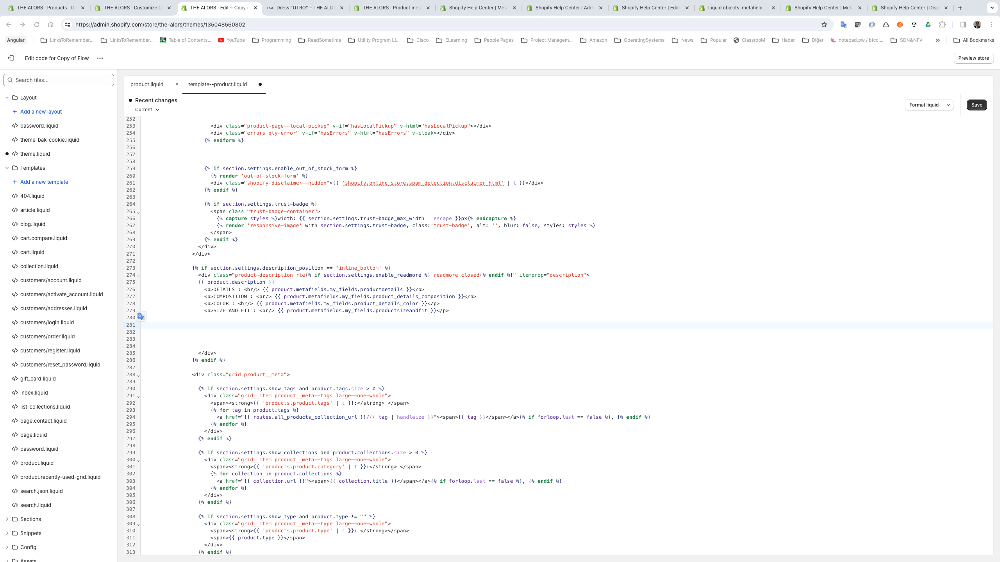

# 20240404 Shopify

##  Metafields in Liquid

```html

  <p>{{ field | first }}: {{ field | last }}</p>

```



##  Collapsable HTML

```html


<!-- {{ product.description }}-->
 <details>
  <summary>DETAILS</summary>
  <p>{{ product.metafields.my_fields.productdetails }}</p>
</details>
<details>
  <summary>COMPOSITION</summary>
  <p>{{ product.metafields.my_fields.product_details_composition }}</p>
</details>
<details>
  <summary>COLOR</summary>
  <p>{{ product.metafields.my_fields.product_details_color }}</p>
</details>
<details>
  <summary>SIZE AND FIT</summary>
  <p>{{ product.metafields.my_fields.productsizeandfit }}</p>
</details>
```
