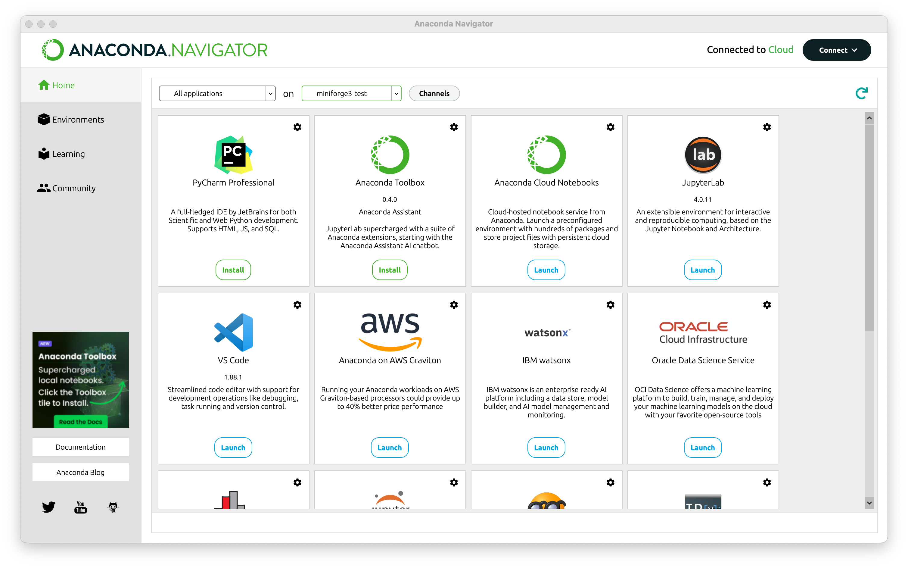

#  20240417 Conda-Forge

## Conda-forge installation and Mac Silicon GPUs

### Some notes from the installation

```shell
sh ~bulent/Downloads/Miniforge3-MacOSX-arm64.sh

```

```shell

To activate this environment, use:

    micromamba activate /Users/bulent/miniforge3

Or to execute a single command in this environment, use:

    micromamba run -p /Users/bulent/miniforge3 mycommand

installation finished.
Do you wish to update your shell profile to automatically initialize conda?
This will activate conda on startup and change the command prompt when activated.
If you'd prefer that conda's base environment not be activated on startup,
   run the following command when conda is activated:

conda config --set auto_activate_base false

You can undo this by running `conda init --reverse $SHELL`? [yes|no]
```

```shell
conda activate /Users/bulent/miniforge3
```

###  From ChatGPT

```shell
conda create -n miniforge3-test python=3.11.7
conda activate miniforge3-test
# or From anaconda you can select the environment and install Jupyter Lab from the dashboard
conda install -c conda-forge jupyterlab
conda install -c apple tensorflow-deps
pip install tensorflow-macos
pip install tensorflow-metal
jupyter-lab 
```



```python
import tensorflow as tf

print("Num GPUs Available: ", len(tf.config.experimental.list_physical_devices('GPU')))
```

## Ollama embedding test

```json
mkdir ollama-embedding-test
cd ollama-embedding-test

conda create -n ollama-embedding-test python=3.10
conda activate ollama-embedding-test
pip install langchain langchain-community langchain-core 
pip install gradio
pip install bs4
pip install tiktoken
pip install chromadb
python app.py

```

```shell
 conda  env remove --name  ollama-embedding-test

```

[Sample Repo](https://github.com/bbmorten/ollama-embedding-test.git)
[Original Code](https://mer.vin/2024/02/ollama-embedding/)

##  RAG GroundX

[GroundX for RAG](https://documentation.groundx.ai/docs/quick-start)

##  Data Analysis with Pandas and Python

[Data Analysis with Pandas and Python](https://learning.oreilly.com/course/data-analysis-with/9781788622394/)

##  Importing Open Source Models to Ollama

[Video](https://www.youtube.com/watch?v=fnvZJU5Fj3Q&t=1s)

##  Langchain Templates #SuperDuper

[Github Link](https://github.com/langchain-ai/langchain/tree/master/templates)

```shell
PINECONE_INDEX_NAME=hede
PINECONE_ENVIRONMENT=us-east-1
GIT_PYTHON_REFRESH=quiet
PINECONE_API_KEY=3c8e04e2-53fb-44b9-83b6-225e51ba3501
OPENAI_API_KEY=sk-proj-3Jnui4rTxLS8h9Uhqau8T3BlbkFJhvRIqsac0K11330yqHd3
```

```shell
pip install -U langchain-cli

```

[Repo test]( https://github.com/bbmorten/langchain-templates-test.git )

##  zsh primer

[To Do List #zsh](https://github.com/rothgar/mastering-zsh/blob/master/docs/config/general.md)

[Terminals are sexy](https://github.com/rothgar/mastering-zsh/blob/master/docs/misc/reference.md)

###  Starship

```shell title=".zshrc"
eval "$(starship init zsh)"

```

```shell
starship preset tokyo-night -o ~/.config/starship/starship.toml

```
