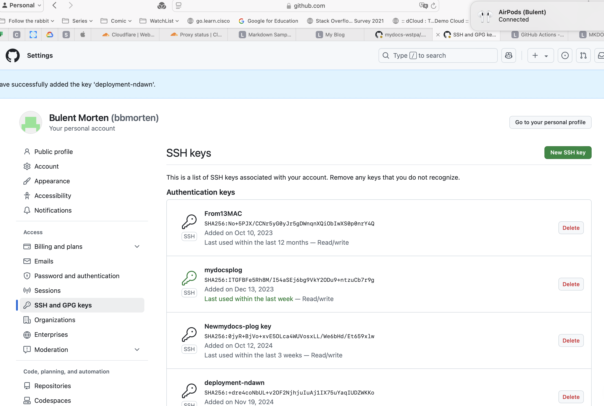

#  GitHub Actions

##  Updating a remote folder with ssh

Prepare the remote machine

```shell
# On ndawn.btegitim.com (Remote VM)

mkdir /home/bulent/.ssh/github
ssh-keygen -t rsa -b 4096 -C "<bbmorten@gmail.com>"
#  Give path /home/bulent/.ssh/github
# Copy the pub key to authorized keys
cat github/id_rsa.pub
echo "ssh-rsa AAAAB3NzaC1yc2EAAAADAQABAAACAQDsDa42qiB2aZ+9lAFR2Pw2NxyBq+1OYf7rhlz31YgL65gkNDcO5k1hoy/pibjrg3MB/2kIRp6+ogg/pfquR1DlBAfr/DpRZPTiq1Zkbuj001gJkLiQBOiiy9LV7HBAIKqfTYlgIn3Q7tUtUeFwUP1lTFX/c2Y6QCxopkho+lBZ3wDEkkgUYoo0bt7sXhbN+C2mMDkRvvkjsUs/k0FhWvSxU6iEDpHqhGXTIr7QPZJ+j/BeeW4ptEF85bfsmIvxPT5Em4IOPCGUjfth6xs0R2MziZ9P3+3L2uNPNW/4V1TdG0SoGqbGuFn01b290jAjgrU909geetTTWtwZtPU3z7YIpwFglrdwL4OggGAswxv0PStTJnP1D3wDBnJtFIVqEx9YLOZK2ZYuV1ekUnYLluyMLxv6wuId78VXcpV6JP6NoZv7bC7Go7N79Hcb84rfVTRWGCiQMZz8Lf8tGpD/LJs2Vnkg3QxUxUtWBcETgUrilQqDjIVb+8AHB89pqJ4bz+70VR2Ke+isR1i/67Hcr0IyckAyZ0R7s3M0zMXC7IjRUDJtV8nFvV8Gk71jb2ZcQ9eGcIJoWQBa3jHV6LYxPVd202dmWr5+QUvLm+pFqbspZ6FolYABWawqvmFvCIoTdfZPHdM34mymUF9+ypvBuIo/QSyV8l5q0mrOQUAYcho4Ww== bbmorten@gmail.com" >> ~/.ssh/authorized_keys
```

Test it from another machine with the private key

```shell

# BMAPMB0422.local
cd /Users/bulent/git-repos/mydocs-wstpa/.ssh
scp bulent@ndawn.btegitim.com:/home/bulent/.ssh/github/id_rsa ./
ssh -i id_rsa bulent@ndawn.btegitim.com
# Success
```

##  Private Repo

### Last actions for deployment-ndawn

- Generate an SSH Key Pair

```shell
bulent@NDAWN-Azure:~/Projects$ ssh-keygen -t ed25519 -C "bbmorten@gmail.com"
Generating public/private ed25519 key pair.
Enter file in which to save the key (/home/bulent/.ssh/id_ed25519): id_ed25519_github_deployment_ndawn
Enter passphrase (empty for no passphrase): 
Enter same passphrase again: 
Your identification has been saved in id_ed25519_github_deployment_ndawn.
Your public key has been saved in id_ed25519_github_deployment_ndawn.pub.
The key fingerprint is:
SHA256:+dre4coNbUL+v2OF2NjhjuIuAj1IX75uYaqIUDZWKKo bbmorten@gmail.com
The key's randomart image is:
+--[ED25519 256]--+
|                 |
|   .             |
|. . .            |
|.. ..   ..    .  |
|. =. + oS .  * o |
|.+ .o + ++ .o = .|
|E    . + o= +o . |
|.. .  o ++.O..+  |
|. . .. +o=Bo=ooo |
+----[SHA256]-----+


```

- Add the ssh key to your github account

```shell

bulent@NDAWN-Azure:~/Projects$ cat id_ed25519_github_deployment_ndawn.pub
ssh-ed25519 AAAAC3NzaC1lZDI1NTE5AAAAII+dG1kGdQeSQy5yv0HM0cjUALWIhcj33SJAtV4i6qz+ bbmorten@gmail.com

```



- Clone a specific branch from the private repo

```shell
mv id_ed25519_github* ~/.ssh
eval "$(ssh-agent -s)
ssh-add  ~/.ssh/id_ed25519_github
git clone -b deployment-ndawn git@github.com:bbmorten/Django-5-by-Example.git
```

- Create a DNS Name

```shell
test.dvmo.uk 52.166.182.13

```

- on ndawn.btegitim.com

```shell
sudo nano /etc/nginx/sites-available/test.dvmo.uk

```

```shell
server {
    listen 80;
    server_name test.dvmo.uk;

    location / {
        proxy_pass http://127.0.0.1:8020;  # Update to the port your Django app uses
        proxy_set_header Host $host;
        proxy_set_header X-Real-IP $remote_addr;
        proxy_set_header X-Forwarded-For $proxy_add_x_forwarded_for;
        proxy_set_header X-Forwarded-Proto $scheme;
    }
}


```

```shell
sudo ln -s /etc/nginx/sites-available/test.dvmo.uk /etc/nginx/sites-enabled/

```

sudo systemctl reload nginx

- GitHUB Connection via ssh

ssh-keygen -t ed25519 -f ~/.ssh/id_ed25519_github_deployment_ndawn_action -C  "<bulent@ndawn.btegitim.com>"
Generating public/private ed25519 key pair.
/home/bulent/.ssh/id_ed25519_github_deployment_ndawn_action already exists.
Overwrite (y/n)? y
Enter passphrase (empty for no passphrase):
Enter same passphrase again:
Your identification has been saved in /home/bulent/.ssh/id_ed25519_github_deployment_ndawn_action.
Your public key has been saved in /home/bulent/.ssh/id_ed25519_github_deployment_ndawn_action.pub.
The key fingerprint is:
SHA256:IJyr4g735gKi9NEKiKAcSflHrD2AQRxtBwGZbahuqkw <bulent@ndawn.btegitim.com>
The key's randomart image is:
+--[ED25519 256]--+
|o=%o+            |
| O B =           |
|o = X .          |
|oo o * .         |
|B . + . S        |
|** o .           |
|OE= o            |
|Bo.+.            |
|++ +o            |
+----[SHA256]-----+
bulent@NDAWN-Azure:~/.ssh$ cat ~/.ssh/id_ed25519_github_deployment_ndawn_action.pub >> authorized_keys

- Public Key is going to GitHUB's SSH and PGP keys' section.

```shell
bulent@NDAWN-Azure:~/.ssh$ cat ~/.ssh/id_ed25519_github_deployment_ndawn_action.pub 
ssh-ed25519 AAAAC3NzaC1lZDI1NTE5AAAAIFtuXYjWVhyTefD8e8XtXNRQRDHY/my2F3BXDda2RG+W bulent@ndawn.btegitim.com

```

- The following command is copied to SSH_PRIVATE_KEY variable in GitHUB settings part.

```shell
SSH_PRIVATE_KEY <-- cat ~/.ssh/id_ed25519_github_deployment_ndawn_action

```

### Old

```shell
ssh-keygen -t ed25519 -C "bbmorten@gmail.com"
mv id_ed25519_github* ~/.ssh
eval "$(ssh-agent -s)"
ssh-add  ~/.ssh/id_ed25519_github
#  Passphrase is Q11W22E33!!??
```
