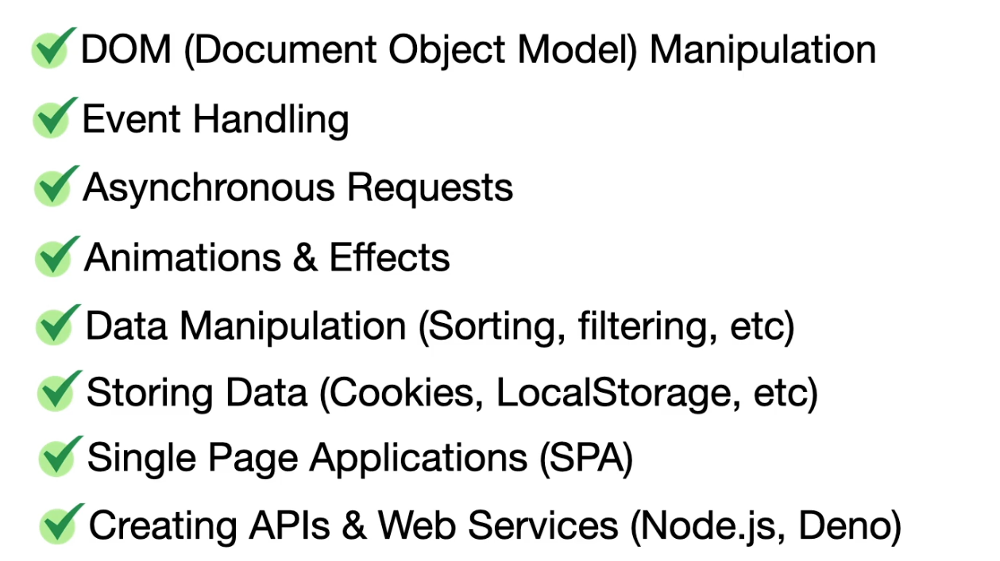

#  Some notes

##  Running NGINX Server for a project

###  Port 8081

```shell
export FOLDERHOME='/Users/bulent/git-repos/elearning/oreilly-courses/javascript/mjfb-brad-traversy/app-mtp-2'
export SVCPORT=8081
docker run \
    --hostname=455095bcef69 \
    --mac-address=02:42:ac:11:00:02 \
    --env=PATH=/usr/local/sbin:/usr/local/bin:/usr/sbin:/usr/bin:/sbin:/bin \
    --env=NGINX_VERSION=1.25.2 \
    --env=NJS_VERSION=0.8.0 \
    --env=PKG_RELEASE=1~bookworm \
    --volume="${FOLDERHOME}:/usr/share/nginx/html" \
    -p ${SVCPORT}:80 \
    --restart=no \
    --label='maintainer=NGINX Docker Maintainers <docker-maint@nginx.com>' \
    --runtime=runc \
    -d nginx:latest


```

###  Port 8082

```shell
export FOLDERHOME='/Users/bulent/git-repos/elearning/oreilly-courses/javascript/mjfb-brad-traversy/app-mtp-panels-highlights'
export SVCPORT=8082
docker run \
    --hostname=455095bcef69 \
    --mac-address=02:42:ac:11:00:02 \
    --env=PATH=/usr/local/sbin:/usr/local/bin:/usr/sbin:/usr/bin:/sbin:/bin \
    --env=NGINX_VERSION=1.25.2 \
    --env=NJS_VERSION=0.8.0 \
    --env=PKG_RELEASE=1~bookworm \
    --volume="${FOLDERHOME}:/usr/share/nginx/html" \
    -p ${SVCPORT}:80 \
    --restart=no \
    --label='maintainer=NGINX Docker Maintainers <docker-maint@nginx.com>' \
    --runtime=runc \
    -d nginx:latest


```

###  Port 8083

```shell
export FOLDERHOME='/Users/bulent/git-repos/elearning/oreilly-courses/javascript/mjfb-brad-traversy/app-mtp-4'
export SVCPORT=8082
docker run \
    --hostname=455095bcef69 \
    --mac-address=02:42:ac:11:00:02 \
    --env=PATH=/usr/local/sbin:/usr/local/bin:/usr/sbin:/usr/bin:/sbin:/bin \
    --env=NGINX_VERSION=1.25.2 \
    --env=NJS_VERSION=0.8.0 \
    --env=PKG_RELEASE=1~bookworm \
    --volume="${FOLDERHOME}:/usr/share/nginx/html" \
    -p ${SVCPORT}:80 \
    --restart=no \
    --label='maintainer=NGINX Docker Maintainers <docker-maint@nginx.com>' \
    --runtime=runc \
    -d nginx:latest


```

##  Supplementals

**Course Supplements Path**: /Users/bulent/git-repos/elearning/oreilly-courses/javascript/mjfb-brad-traversy

##  VSCode Profile

MJFB-BT is being used. Look for the extensions.

```json title='.vscode/settings.json'

{
  "prettier.singleQuote": true,
  "editor.formatOnSave": true,
  "editor.defaultFormatter": "esbenp.prettier-vscode",
  "explorer.compactFolders": false,
  "liveServer.settings.CustomBrowser": "chrome:PrivateMode",
  "prettier.semi": true,
  "liveServer.settings.port": 5501
}
```

##  Docker run command to initialize a NGNIX server

```python
docker run --hostname=455095bcef69 --mac-address=02:42:ac:11:00:02 \ 
    --env=PATH=/usr/local/sbin:/usr/local/bin:/usr/sbin:/usr/bin:/sbin:/bin \
    --env=NGINX_VERSION=1.25.2 \ 
    --env=NJS_VERSION=0.8.0 \ 
    --env=PKG_RELEASE=1~bookworm \
    --volume=/Users/bulent/git-repos/elearning/oreilly-courses/javascript/mjfb-brad-traversy/09-asynchronous-javascript:/usr/share/nginx/html \ 
    -p 8000:80 --restart=no --label='maintainer=NGINX Docker Maintainers <docker-maint@nginx.com>' \
    --runtime=runc -d nginx:latest
```

##  Topics


