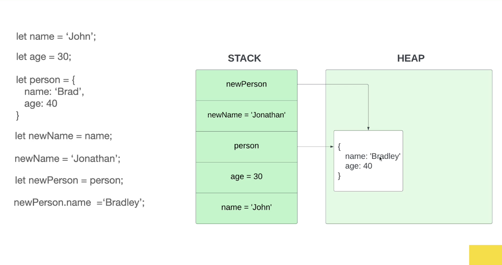
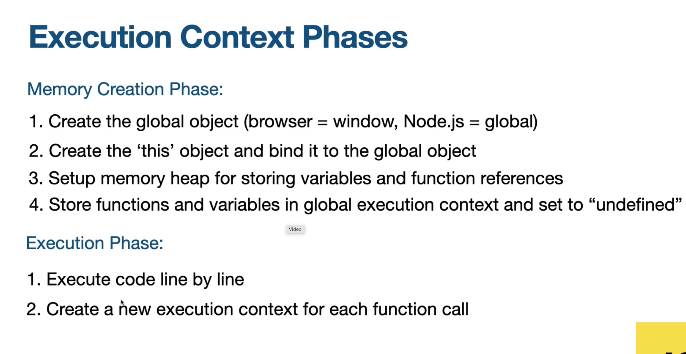
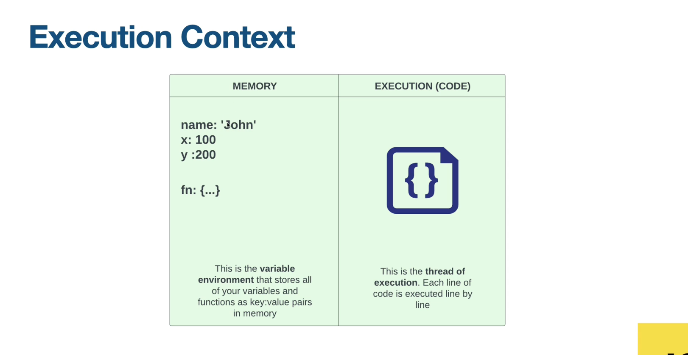
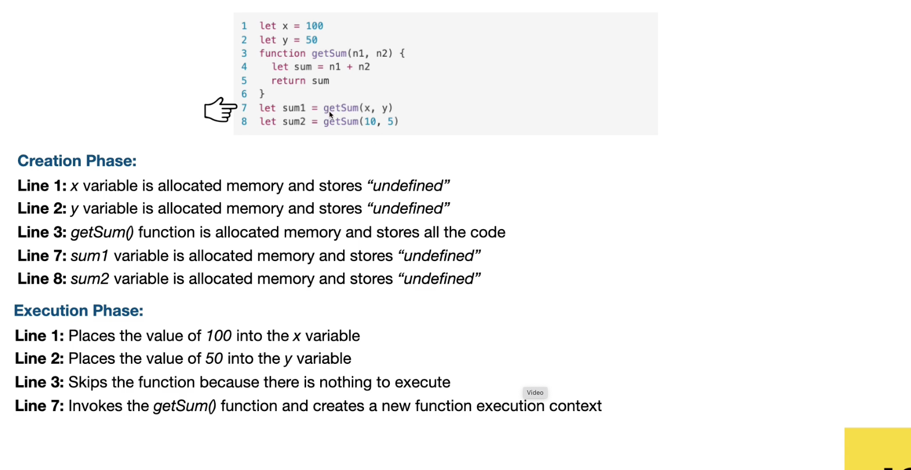
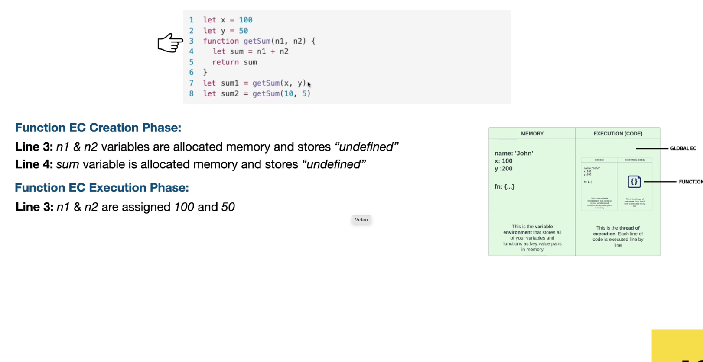

# Chapter 2-5

## Errata

- Day 1 - 20240318
- Day 2 - 20240321
- Day 3 - 20240325
- Day 4 - 20240326

<!-- Day 1 - 20240318  -->

##  New website

- index.html, style.css and script.js are created

##  Developer Mode on Chrome

##  01-variables-data-types

###  01 - console

console.log, console.err, console.warn, console.table, console.group, console.log with styles

```javascript
console.log('Console Message 1 ... ')
console.log(100)
console.log(20, 'Hello', true)

const x = 200
console.log(x)

console.error('Alert')
console.warn('Warning')

console.table({ name: 'Bülent', lastName: 'Morten' })

console.group('Starting Group 1')
console.log(x)
console.error('Alert')
console.warn('Warning')
console.table({ name: 'Bülent', lastName: 'Morten' })
console.groupEnd()

const styles = 'padding: 10px; background-color: white; color:green'

console.log('%cHello World', styles)

console.log('%cHello %cWorld', 'color: blue;', 'color: green; font-weight: bold;');

```

### 02 - comments

Shortcuts

| Description       | Keybindings                   |
| ----------------- | ----------------------------- |
| Cursor Move  | Option + Left/Right, Command + Left/Right |
| Selection    | Shift + Cursor Move |
| Move the line    | Option + Up/Down |
| Duplicate the line   | Shift + option + up/down |
| Multiple Cursor  | Highlight and then hit Cmd + D to expand next one, Cmd + Shift + L |
| Multiple | Option + Click |
| File Search  | cmd + shift + o |
| In file search   | cmd + shift + f |
| Toogle Side Bar  | cmd + b |

<!-- Day 2 - 20240321 -->

###  03 - variables

```javascript

// Ways to declare a variable
// `var`, `let`, & `const`

let firstName = 'John';
const lastName = 'Doe';
let age = 30;

console.log(age);

// Naming Conventions
// - Only letters, numbers, underscores and dollar signs
// - Can't start with a number

// Multi-Word Formatting
// firstName = camelCase
// first_name = underscore
// FirstName = PascalCase
// firstname = lowercase

// We can re-assign `let` variables. If you change `age` to use `const`, you will get an error
age = 31;
console.log(age);

// With let, we can declare a value without assigning a value
let score;
score = 1;
console.log(score);

if (true) {
  score = score + 1;
}

console.log(score);

const x = 100;

// We can not re-assign a const variable
// x = 200 // Will result in an error

// We can still manipulate arrays and objects using const
const arr = [1, 2, 3, 4];
arr.push(5);
console.log(arr);

const person = {
  name: 'Brad',
};
person.name = 'John';
person.email = 'brad@gmail.com';
console.log(person);

// Declare multiple values at once
let a, b, c;

const d = 10,
  e = 20,
  f = 30;

console.log(d);
console.log(a);

```

### 04 - datatypes, stack vs. heap

Primitive vs. Reference Types

- Primitive

    - String, Number, Boolean, Null, Undefined, Symbol, BigInt
    - Stored in stack

- Reference types

    - Arrays, Functions, Objects
    - Stored in heap

Null vs. undefined

javascript is dynamically-typed language
typescript allows static-typing

```console
// String

const firstName = 'Bülent';

const output = firstName;

console.log(output, typeof output);

// Number

const age = 40;

const temp = 98.9;

console.log(age, temp);

// Boolean

const hasKids = true;

// Null

const aptNumber = null;
const output2 = aptNumber;
console.log(output2, typeof output2);

// Undefined

// Symbol

const id = Symbol('id');


const Person = { name: 'Bülent', age: 52, [id]: '0001' };

console.log(Person[id]);
console.log(Person['name']);
console.log(Person.name);

// BigInt

const n = 4583958395894853954893845n;

console.log(n, typeof n);

// Reference Types

function sayHello() {
  console.log('Hello');
}

console.log(sayHello, typeof sayHello);

let name = 'John';
let ageX = 30;
let personX = {
  name: 'Brad',
  age: 40,
};

let newName = name;
newName = 'Jonathan';
let newPerson = personX;
newPerson.age = 55;

console.log(personX, newPerson);

console.log(newName, name);

const PersonY = {
  name: 'Bülent',
  age: 56,
};

const newPersonC = PersonY;
PersonY.name = 'Volkan';
PersonY.lastName = 'Morten';

console.log(newPersonC, PersonY);

let newPersonLet = PersonY;
PersonY.name = 'Duygu';
PersonY.lastName = 'MortenX';

console.log(newPersonLet, PersonY);
```

On breakpoint you can see the stack status
To see the heap you should take a snapshot. (From memory panel)



###  06 - type conversion

- Temporary wrappers from JS for primitive data types
- NaN : Not a number and type is number

```javascript
let amount = 'hello';

// Convert string to number
amount = parseInt(amount);
amount = +amount;
amount = Number(amount);

let octet1 = '11000000'
console.log(parseInt(octet1,2))
// Prints out 192

// Convert number to string
amount = amount.toString();
amount = String(amount);

// Convert string to decimal
amount = parseFloat(amount);

// Convert number to boolean
amount = Boolean(amount);

// Ways to get NaN
param1 = Math.sqrt(-1)
console.log(param1, typeof param1)
console.log(Math.sqrt(-1));
console.log(1 + NaN);
console.log(undefined + undefined);
console.log('foo' / 3);

console.log(amount, typeof amount);

```

### 07 - operators

```javascript

// 1. Arithmetic Operators

let x;

x = 5 + 5;
x = 5 - 5;
x = 5 * 5;
x = 5 / 5;
x = 7 % 5;

// Concatenation
x = 'Hello' + ' ' + 'World';

// Exponent
x = 2 ** 3;

// Increment
x = 1;
// x = x + 1;
x++;

// Decrement
// x = x - 1;
x--;

// 2. Assignment Operators

x = 10;

x += 5;
x -= 5;
x *= 5;
x /= 5;
x %= 5;
x **= 5;

// 3. Comparison Operators

// Equal to (Just the value, not the type)
x = 2 == '2';

// Equal to (Type and value)
x = 2 === '2';

// Not equal to (Just the value, not the type)
x = 2 != '2';

// Not equal to (Type and value)
x = 2 !== 2;

// Greater than and less than
x = 10 > 5;
x = 10 < 5;
x = 10 <= 5;
x = 10 >= 5;

console.log(x);

```

### 08 - type coercion

```javascript
let x;

// Coerced to a string
x = 5 + '5';

x = 5 + Number('5');

// Coerced to a number
x = 5 * '5';

// null is coerced to 0 as it is a `falsy` value
x = 5 + null;

x = Number(null);

x = Number(true);
x = Number(false);

// true is coerced to a 1
x = 5 + true;

// false is coerced to 0 (falsy)
x = 5 + false;

// Undefined is coerced to 0 (falsy)
x = 5 + undefined;

console.log(x, typeof x);

```

###  09 - Strings

```javascript
let x;

const name = 'John';
const age = 31;

// Concatenation
x = 'Hello, my name is ' + name + ' and I am ' + age + ' years old';

// Template Literals
x = `Hello, my name is ${name} and I am ${age} years old`;

// String Properties and Methods

// Creating a "string object" (JS does this automatically when using a propery or method on a primitive string)
const s = new String('Hello World');

x = typeof s;

x = s.length;

// Access value by key
x = s[0];

// Shows the prototype of the string object. Shows the properties and methods
x = s.__proto__;

// Change case
x = s.toUpperCase();
x = s.toLowerCase();

// charAt() - returns the character at the specified index
x = s.charAt(0);

// indexOf - returns the index of the first occurrence of a specified value in a string
x = s.indexOf('d');

// substring() - search a string for a specified value
x = s.substring(2, 5);
x = s.substring(7);

// slice() - extracts a part of a string and returns a new string
x = s.slice(-11, -6);

// trim() - remove whitespace from beginning and end of string
x = '         Hello World';
x = x.trim();

// replace() - replace all instances of a string
x = s.replace('World', 'John');

// includes() - returns true if the string is found
x = s.includes('Hell');

// valueOf() - returns the primitive value of a variable
x = s.valueOf();

// split() - returns an array of strings
x = s.split('');

console.log(x);
```

### 11 - Numbers

```javascript

let x;

const num = new Number(5);

// toString() - returns a string representation of the number
x = num.toString();
// To get the length
x = num.toString().length;

// toFixed() - returns a string representation of the number with a specified number of decimals
x = num.toFixed(2);

// toPrecision() - returns a number with the specified length
x = num.toPrecision(3);

// toExponential() -  convert a number to exponential notation and return its value as a string
x = num.toExponential(2);

// toLocaleString() - returns a string representation of the number, using the current locale
x = num.toLocaleString('en-US');

// valueOf - Get value
x = num.valueOf();

// The Number object itself has some properties and methods

// Largest and smallest possible number
x = Number.MAX_VALUE;
x = Number.MIN_VALUE;

console.log(x);

```

12 - Math object

```javascript

let x;

// Square root
x = Math.sqrt(9);

// Absolute value
x = Math.abs(-5);

// Round
x = Math.round(4.2);

console.log(x);

x = Math.round(4.6);

console.log(x);

// Round up
x = Math.ceil(4.2);

console.log(x);

// Round down
x = Math.floor(4.9);

console.log(x);

// Exponent
x = Math.pow(2, 3);

// Minimum number
x = Math.min(4, 5, 3);

// Maximum number
x = Math.max(4, 5, 3);

// Get a random number/decimal between 0 and 1
x = Math.random();

// Get a random number between 1 and 100
x = Math.floor(Math.random() * 100 + 1);

console.log(x);

```

### 14 - Date and times object

```javascript
let d;

// Get today's date and time
d = new Date();

// Set to a string
d = d.toString();

// Get a specific date
// Important: the month is 0-based, so 0 is January and 11 is December
d = new Date(2021, 0, 10, 12, 30, 0);

// Pass in a string
d = new Date('2021-07-10T12:30:00');
d = new Date('07/10/2021 12:30:00');
d = new Date('2022-07-10');
d = new Date('07-10-2022');

// https://stackoverflow.com/questions/7556591/is-the-javascript-date-object-always-one-day-off

// Get current timestamp
d = Date.now();

// Get the timestamp of a specific date
d = new Date();
d = d.getTime();
d = d.valueOf();

// Create a date from a timestamp
d = new Date(1666962049745);

// Convert from milliseconds to seconds
d = Math.floor(Date.now() / 1000);

console.log(d);

```

**timestamps in javascript are in miliseconds**

Be careful about that.

### 15 - date-object-methods

```javascript

let x;
let d = new Date();

// Date methods

x = d.toString();
console.log(x);

x = d.getTime();
console.log(x);

x = d.valueOf();
console.log(x);

x = d.getFullYear();
console.log(x);

x = d.getMonth();
console.log(x);
x = d.getMonth() + 1;
console.log(x);

x = d.getDate();
console.log(x);

x = d.getDay();
console.log(x);

x = d.getHours();
console.log(x);

x = d.getMinutes();
console.log(x);

x = d.getSeconds();
console.log(x);

x = d.getMilliseconds();
console.log(x);

x = `${d.getFullYear()}-${d.getMonth() + 1}-${d.getDate()}`;
console.log(x);

x = Intl.DateTimeFormat('en-US').format(d);
console.log(x);
x = Intl.DateTimeFormat('en-GB').format(d);
console.log(x);
x = Intl.DateTimeFormat('default').format(d);
console.log(x);

x = Intl.DateTimeFormat('default', { month: 'long' }).format(d);
console.log(x);

x = d.toLocaleString('default', { month: 'short' });
console.log(x);

x = d.toLocaleString('default', {
  weekday: 'long',
  year: 'numeric',
  month: 'long',
  day: 'numeric',
  hour: 'numeric',
  minute: 'numeric',
  second: 'numeric',
  timeZone: 'America/New_York',
});
console.log(x);

```
<!-- Day 3 - 20240325 -->

## 02-arrays-and-objects

###  01-array-basics

```javascript
let x;

// Array Literal
console.group('Array Literal');
const numbers = [12, 45, 33, 29, 39, 102];
console.log(numbers, typeof numbers);
const mixed = [12, 'Hello', true, null];
console.log(mixed, typeof mixed);

// Array Constructor
const fruits = new Array('apple', 'grape', 'orange');
console.log(fruits, typeof fruits, fruits.length);

console.groupEnd();

// Get value by index
x = numbers[0];

x = numbers[0] + numbers[3];

x = `My favorite fruit is an ${fruits[2]}`;

x = numbers.length;

fruits[2] = 'pear';

// length is not read-only
// fruits.length = 2;

fruits[3] = 'strawberry';

// Using the length as the index will always add on the the end
fruits[fruits.length] = 'blueberry';
fruits[fruits.length] = 'peach';

mixed[mixed.length] = 'Deneme';

x = fruits;

console.log(x);
```

###  02-array-methods

```javascript
let x;

const arr = [28, 38, 44, 29, 109];

// push() - Push a value on to the end of the array
arr.push(100);

console.log(arr);

// pop() - Take the last value off
arr.pop();

console.log(arr);

// unshift() - Add a value to the beginning of the array
arr.unshift(99);

console.log(arr);

// shift() - Remove first value
arr.shift();

console.log(arr);

// reverse() - Reverse an array
arr.reverse();

console.log(arr);

// includes() - Check to see if something is in the array
x = arr.includes(445);

console.log(x);

// indexOf() - Return the index of the first match
x = arr.indexOf(28);

console.log(x);

// Return array as a string
x = arr.toString();

console.log(x);

x = arr.join();

console.log(x);

console.group('Slice/splice');

// slice() returns selected elements in an array, as a new array. Slice takes in the index of the first element and the index of the last element to be included in the new array.
x = arr.slice(1, 4);

console.log(arr);
console.log(x);

// splice() works like slice() except it takes the index of the first element and the number of elements after that as a second argument. it also mutates the original array where slice() does not
x = arr.splice(1, 4);

console.log(arr);
console.log(x);

// Remove a single element/value - The following will mutate the original array by taking out the element with the index of 4. x will be equal to a new array with that plucked out value.

const arr2 = [28, 38, 44, 29, 109];

x = arr2.splice(4, 1);

console.log(arr2);
console.log(x);

console.groupEnd();

// Chaining methods - Some methods can be chained depending on the return value.

console.log(arr2);
x = arr2.slice(1, 4).reverse().toString().charAt(0);

console.log(x);
```

### 03-array-nesting-concat-spread

```javascript

let x;

const fruits = ['apple', 'pear', 'orange'];
const berries = ['strawberry', 'blueberry', 'rasberry'];

// Nesting arrays

// Nesting berries inside of fruits
fruits.push(berries);

console.log(fruits);

// Now we can access 'blueberry' with the following
x = fruits[3][1];

// Create a new variable and nest both arrays
const allFruits = [fruits, berries];

console.log(allFruits);

x = allFruits[1][2];

// concat() - Concatenate arrays
x = fruits.concat(berries);

console.log(x);

// spread operator (...) - Concatenate with
x = [...fruits, ...berries];

console.log(x);

// flat() - Flatten an array
const arr = [1, 2, [3, 4, 5], 6, [7, 8]];
x = arr.flat();

console.log(x);
// Static methods of Array object

// isArray() - Check is is an array
x = Array.isArray(fruits);

x = Array.isArray('Hello');

// false is coming
console.log(x);

// from() - Create an array from an array like value
x = Array.from('12345');

console.log(x);

// of() - Create an array from a set of values
const a = 1;
const b = 2;
const c = 3;

x = Array.of(a, b, c);

console.log(x);

```

### 05-object-literals

```javascript
let x;

// Creating an object
const person = {
  name: 'John Doe',
  age: 30,
  isAdmin: true,
  address: {
    street: '123 Main st',
    city: 'Boston',
    state: 'MA',
  },
  hobbies: ['music', 'sports'],
};

// Accessing object properties
x = person.name; // Dot notation
x = person['age']; // Bracket notation
x = person.address.state;
x = person.hobbies[0];

// Updating properties
person.name = 'Jane Doe';
person['isAdmin'] = false;

// Deleting properties
delete person.age;

// Create new properties
person.hasChildren = true;

// Add functions
person.greet = function () {
  console.log(`Hello, my name is ${this.name}`);
};

person.greet();

// Keys with multiple words
const person2 = {
  'first name': 'Brad',
  'last name': 'Traversy',
};

x = person2['first name'];

console.log(x);
```

###  06-object-spread-methods

```javascript
let x;

// Create object using the object constructor
const todo = new Object();

todo.id = 1;
todo.name = 'Buy Milk';
todo.completed = false;

x = todo;

// Object Nesting
const person = {
  address: {
    coords: {
      lat: 42.9384,
      lng: -71.3232,
    },
  },
};

x = person.address.coords.lat;

const obj1 = { a: 1, b: 2 };
const obj2 = { c: 3, d: 4 };

// Spread operator
const obj3 = { ...obj1, ...obj2 };
// Same as using ...
const obj4 = Object.assign({}, obj1, obj2);

console.log(obj3, obj4);

// Array of objects
const todos = [
  { id: 1, name: 'Buy Milk' },
  { id: 2, name: 'Pickup kids from school' },
  { id: 3, name: 'Take out trash' },
];

x = todos[0].name;

// Get array of object keys
x = Object.keys(todo);

// Get length of an object
x = Object.keys(todo).length;

// Get array of object values
x = Object.values(todo);

// Get array of object key/value pairs
x = Object.entries(todo);

// Check if object has a property
x = todo.hasOwnProperty('age');

console.log(x);

keys = Object.keys(obj3);

console.log(keys);

values = Object.values(obj3);

console.log(values);

entries = Object.entries(obj3);

console.log(entries);

const sample = `This is the key : ${entries[0][0]}, this is the value : ${entries[0][1]}`;

console.log(sample);

```

### 07-destructuring-naming

**Destructuring part on objects and arrays are important**

```javascript
// Setting object properties with the same name as a variable
const firstName = 'John';
const lastName = 'Doe';
const age = 30;

const person = {
  firstName,
  lastName,
  age,
};

console.log(person.age);

// Destructuring object properties

const todo = {
  id: 1,
  title: 'Take out trash',
  user: {
    name: 'John',
  },
};

const {
  id: todoId, // rename id to todoId
  title,
  user: { name }, // destructuring multiple levels
} = todo;

console.log(todoId);

// Destructuring arrays & using the rest/spread operator
const numbers = [23, 67, 33, 49, 52];

const [first, second, ...rest] = numbers;

console.log(first, second, rest);

```

###  08-json-intro

<https://api.github.com/users/bbmorten/repos>

####  JSON.stringfy

| Function | Description |
| ----------------- | ------------------- |
| JSON.stringfy | Object --> JSON String |

```javascript title='Object'
const family = {
  father : 'Bülent',
  mother : 'Ferah',
  siblings : ['Duygu', 'Volkan']
}

jfamily = JSON.stringfy(family)
jfamily
// javascript literal
'{"father":"Bülent","mother":"Ferah","siblings":["Duygu","Volkan"]}'
// json literal
"{\"father\":\"Bülent\",\"mother\":\"Ferah\",\"siblings\":[\"Duygu\",\"Volkan\"]}"
// string
{"father":"Bülent","mother":"Ferah","siblings":["Duygu","Volkan"]}

```

```javascript title='Array with 2 Objects'


const repos = [{ 
login: "bbmorten",
id: 8436491,
node_id: "MDQ6VXNlcjg0MzY0OTE=",
avatar_url: "https://avatars.githubusercontent.com/u/8436491?v=4",
gravatar_id: "",
url: "https://api.github.com/users/bbmorten",
html_url: "https://github.com/bbmorten",
followers_url: "https://api.github.com/users/bbmorten/followers",
following_url: "https://api.github.com/users/bbmorten/following{/other_user}",
gists_url: "https://api.github.com/users/bbmorten/gists{/gist_id}",
starred_url: "https://api.github.com/users/bbmorten/starred{/owner}{/repo}",
subscriptions_url: "https://api.github.com/users/bbmorten/subscriptions",
organizations_url: "https://api.github.com/users/bbmorten/orgs",
repos_url: "https://api.github.com/users/bbmorten/repos",
events_url: "https://api.github.com/users/bbmorten/events{/privacy}",
received_events_url: "https://api.github.com/users/bbmorten/received_events",
type: "User",
site_admin: false,
name: "Bulent Morten",
company: null,
blog: "",
location: null,
email: null,
hireable: null,
bio: null,
twitter_username: null,
public_repos: 127,
public_gists: 3,
followers: 7,
following: 10,
created_at: "2014-08-13T08:50:36Z",
updated_at: "2024-03-13T07:12:43Z"
},
{
login: "bbmorten",
id: 8436491,
node_id: "MDQ6VXNlcjg0MzY0OTE=",
avatar_url: "https://avatars.githubusercontent.com/u/8436491?v=4",
gravatar_id: "",
url: "https://api.github.com/users/bbmorten",
html_url: "https://github.com/bbmorten",
followers_url: "https://api.github.com/users/bbmorten/followers",
following_url: "https://api.github.com/users/bbmorten/following{/other_user}",
gists_url: "https://api.github.com/users/bbmorten/gists{/gist_id}",
starred_url: "https://api.github.com/users/bbmorten/starred{/owner}{/repo}",
subscriptions_url: "https://api.github.com/users/bbmorten/subscriptions",
organizations_url: "https://api.github.com/users/bbmorten/orgs",
repos_url: "https://api.github.com/users/bbmorten/repos",
events_url: "https://api.github.com/users/bbmorten/events{/privacy}",
received_events_url: "https://api.github.com/users/bbmorten/received_events",
type: "User",
site_admin: false,
name: "Bulent Morten",
company: null,
blog: "",
location: null,
email: null,
hireable: null,
bio: null,
twitter_username: null,
public_repos: 127,
public_gists: 3,
followers: 7,
following: 10,
created_at: "2014-08-13T08:50:36Z",
updated_at: "2024-03-13T07:12:43Z"
}]

const jrepos = JSON.stringify(repos)

// JSON String
jrepos
'[{"login":"bbmorten","id":8436491,"node_id":"MDQ6VXNlcjg0MzY0OTE=","avatar_url":"https://avatars.githubusercontent.com/u/8436491?v=4","gravatar_id":"","url":"https://api.github.com/users/bbmorten","html_url":"https://github.com/bbmorten","followers_url":"https://api.github.com/users/bbmorten/followers","following_url":"https://api.github.com/users/bbmorten/following{/other_user}","gists_url":"https://api.github.com/users/bbmorten/gists{/gist_id}","starred_url":"https://api.github.com/users/bbmorten/starred{/owner}{/repo}","subscriptions_url":"https://api.github.com/users/bbmorten/subscriptions","organizations_url":"https://api.github.com/users/bbmorten/orgs","repos_url":"https://api.github.com/users/bbmorten/repos","events_url":"https://api.github.com/users/bbmorten/events{/privacy}","received_events_url":"https://api.github.com/users/bbmorten/received_events","type":"User","site_admin":false,"name":"Bulent Morten","company":null,"blog":"","location":null,"email":null,"hireable":null,"bio":null,"twitter_username":null,"public_repos":127,"public_gists":3,"followers":7,"following":10,"created_at":"2014-08-13T08:50:36Z","updated_at":"2024-03-13T07:12:43Z"},{"login":"bbmorten","id":8436491,"node_id":"MDQ6VXNlcjg0MzY0OTE=","avatar_url":"https://avatars.githubusercontent.com/u/8436491?v=4","gravatar_id":"","url":"https://api.github.com/users/bbmorten","html_url":"https://github.com/bbmorten","followers_url":"https://api.github.com/users/bbmorten/followers","following_url":"https://api.github.com/users/bbmorten/following{/other_user}","gists_url":"https://api.github.com/users/bbmorten/gists{/gist_id}","starred_url":"https://api.github.com/users/bbmorten/starred{/owner}{/repo}","subscriptions_url":"https://api.github.com/users/bbmorten/subscriptions","organizations_url":"https://api.github.com/users/bbmorten/orgs","repos_url":"https://api.github.com/users/bbmorten/repos","events_url":"https://api.github.com/users/bbmorten/events{/privacy}","received_events_url":"https://api.github.com/users/bbmorten/received_events","type":"User","site_admin":false,"name":"Bulent Morten","company":null,"blog":"","location":null,"email":null,"hireable":null,"bio":null,"twitter_username":null,"public_repos":127,"public_gists":3,"followers":7,"following":10,"created_at":"2014-08-13T08:50:36Z","updated_at":"2024-03-13T07:12:43Z"}]'

```

#### JSON.parse

| Function | Description |
| ----------------- | ------------------- |
| JSON.parse |str --> Object |

```javascript
const str = "{\"father\":\"Bülent\",\"mother\":\"Ferah\",\"siblings\":[\"Duygu\",\"Volkan\"]}";
JSON.parse(str)
{ father: 'Bülent', mother: 'Ferah', siblings: [ 'Duygu', 'Volkan' ] }
```

<!-- 2024032601 -->

## 03-functions-scope

### 01-function-basics

### 02-params-arguments

### 03-global-function-scope

###  04-block-scope

- var is function scoped
- var defined variables are added to the window object

```javascript
const x = 100;

// An If statement is a block
if (true) {
  console.log(x);
  const y = 200;
  console.log(x + y);
  var zx = 900;
}

console.log(zx);

// console.log(y); // ReferenceError: y is not defined

// A loop is a block
for (let i = 0; i <= 10; i++) {
  console.log(i);
}

// console.log(i); // ReferenceError: i is not defined

// A loop is a block
for (var i = 0; i <= 10; i++) {
  console.log(i);
}

console.log(i); // 

// Using var
if (true) {
  const a = 500;
  let b = 600;
  var c = 700;
}

console.log(c);

// var IS function scoped
function run() {
  var d = 100;
  console.log(d);
}

run();

// console.log(d);

const foo = 1;
var bar = 2; // Put on the window object
```

###  05-nested-scope

- You can access parent variables but you can not access child variables

```javascript
function first() {
  const x = 100;

  function second() {
    const y = 200;
    console.log(x + y);
  }

  console.log(y);

  second();
}

first();

if (true) {
  const x = 100;

  if (x === 100) {
    const y = 200;
    console.log(x + y);
  }

  console.log(y);
}
```

###  06-declaration-vs-expression

```javascript
// Function Declaration
function addDollarSign(value) {
  return '$' + value;
}

// When using declarations, you can invoke the function before the declaration. With expressions, you can not
console.log(addDollarSign(100));

// Function Expression
const addPlusSign = function (value) {
  return '+' + value;
};

console.log(addPlusSign(200));

function printLen(str) {
  console.log(str.length);
}

printLen('Bülent');

const printLen2 = function (str) {
  console.log(str.length);
};

printLen2('Bülent');

const printLen3 = (str) => {
  console.log(str.length);
};

printLen3('Bülent');

```

###  07-arrow-functions

```javascript

//  Normal function declaration
// function add(a, b) {
//   return a + b;
// }

// Arrow function syntax
const add = (a, b) => {
  return a + b;
};

// Implicit Return (no return statemet is needed)
const subtract = (a, b) => a - b;

// Can leave off () with a single param
const double = (a) => a * 2;

// Returning an object
const createObj = () => ({
  name: 'Brad',
});

const numbers = [1, 2, 3, 4, 5];

numbers.forEach(function (n) {
  console.log(n);
});

// Arrow function in a callback
numbers.forEach((n) => console.log(n));

console.log(add(1, 2));
console.log(subtract(10, 5));
console.log(double(10));
console.log(createObj());

```

### 08-iife - IIFE (Immediately Invoked Function Expressions)

```javascript
// IFFE Syntax (Has it's own scope and runs right away)
(function () {
  const user = 'John';
  console.log(user);
  const hello = () => console.log('Hello from the IIFE');
  hello();
})();

// Params
(function (name) {
  console.log('Hello ' + name);
})('Shawn');

// Named IIFE (Can only be called recursively)
(function hello() {
  console.log('Hello');
})();


```

### 09-function challenges

```javascript title='Minmax function'
> const minMax = (arr) => ({ minimum : Math.min(...arr), maximum : Math.max(...arr)})

```

###  10-execution-context-in-action




```javascript
//  Go to 'sources' tab and add a breakpoint at the first line and step through to see the execution phase in action
const x = 100;
const y = 50;

function getSum(n1, n2) {
  const sum = n1 + n2;
  return sum;
}

const sum1 = getSum(x, y);
const sum2 = getSum(10, 5);

console.log(sum1, sum2);


```





###  11-call-stack

```javascript
// Open 'sources' tab and put a breakpoint at the first() function

// First Example

function first() {
  console.log('first...');
}

function second() {
  console.log('second...');
}

function third() {
  console.log('third...');
}

first();
second();
third();

// Second Example

// function first() {
//   console.log('first...');
//   second();
// }

// function second() {
//   console.log('second...');
//   third();
// }

// function third() {
//   console.log('third...');
// }

// first();

```

## 04-logic-control-flow

###  01-if-statements

```javascript
// If Statement Syntax
if (true) {
  console.log('This is true');
}

if (false) {
  console.log('This is NOT true');
}

// Evaluation expressions
const x = 10;
const y = 5;

if (x >= y) {
  console.log(`${x} is greater than or equal to ${y}`);
}

if (x === y) {
  console.log(`${x} is equal to ${y}`);
} else {
  console.log(`${x} is NOT equal to ${y}`);
}

// Block scope
if (x !== y) {
  const z = 20;
  console.log(`${z} is 20`);
}

console.log(z); // Throw error

// Shorthand If/Else
if (x >= y)
  console.log(`${x} is greater than or equal to ${y}`),
    console.log('This is true');
else console.log('This is false');

```

### 02-else-if-nesting

```javascript
const d = new Date(10, 30, 2022, 6, 0, 0);
const hour = d.getHours();

if (hour < 12) {
  console.log('Good Morning');
} else if (hour < 18) {
  console.log('Good Afternoon');
} else {
  console.log('Good Night');
}

// Nested If
if (hour < 12) {
  console.log('Good Morning');

  if (hour === 6) {
    console.log('Wake Up!');
  }
} else if (hour < 18) {
  console.log('Good Afternoon');
} else {
  console.log('Good Night');

  if (hour >= 20) {
    console.log('zzzzzzzz');
  }
}

if (hour >= 7 && hour < 15) {
  console.log('It is work time!');
}

if (hour === 6 || hour === 20) {
  console.log('Brush your teeth!');
}

```

### 03-switches

```javascript
const d = new Date(2022, 1, 10, 16, 0, 0);
const month = d.getMonth();
const hour = d.getHours();

// Immediate value evaluation
switch (month) {
  case 1:
    console.log('It is January');
    break;
  case 2:
    console.log('It is February');
    break;
  case 3:
    console.log('It is March');
    break;
  default:
    console.log('It is not Jan, Feb or March');
}

// Range evaluation
switch (true) {
  case hour < 12:
    console.log('Good Morning');
    break;
  case hour < 18:
    console.log('Good Afternoon');
    break;
  default:
    console.log('Good Night');


}

let x = 1;
let y = 10;

switch (true) {
  case x >= 1:
    console.log('Good Morning');
    break;
  case y <= 10 :
    console.log('Good Afternoon');
    break;
  default:
    console.log('Good Night');


}

```

###  05-truthy-falsy

```javascript
// Falsy Values:
// - false
// - 0
// - "" or '' (Empty string)
// - null
// - undefined
// - NaN

// Truthy Values:
// - Everything else that is not falsy
// - true
// - '0' (0 in a string)
// - ' ' (space in a string)
// - 'false' (false in a string)
// - [] (empty array)
// - {} (empty object)
// - function () {} (empty function)

const x = function () {};

if (x) {
  console.log('This is truthy');
} else {
  console.log('This is falsy');
}

console.log(Boolean(x));

// Truthy and falsy caveats
const children = 3;

// Checking for literal 0
if (children) {
  console.log(`You have ${children} children`);
} else {
  console.log('Please enter number of children');
}

// Solution
if (!isNaN(children)) {
  console.log(`You have ${children} children`);
} else {
  console.log('Please enter number of children');
}

// Checking for empty arrays
const posts = ['Post One'];

// Always true even when empty
if (posts) {
  console.log('List Posts');
} else {
  console.log('No Posts To List');
}

// Solution
if (posts.length > 0) {
  console.log('List Posts');
} else {
  console.log('No Posts To List');
}

// Checking for empty objects
const user = {
  name: 'Brad',
};

// Always true, even when no properties
if (user) {
  console.log('List User');
} else {
  console.log('No User');
}

// Solution
if (Object.keys(user).length > 0) {
  console.log('List User');
} else {
  console.log('No User');
}

// Loose Equality (==)
console.log(false == 0); // true
console.log('' == 0); // true
console.log(null == undefined); // true

// Strict Equality
console.log(false === 0); // false
console.log('' === 0); // false
console.log(null === undefined); // false

```

```python
import requests

response = requests.get('Www.google.com')
ls -la 
cp
```

### 06-logical operators

bbmorten: logical operator precedence in javascript

GitHub Copilot: In JavaScript, logical operators have the following precedence, from highest to lowest:

1. Logical NOT (`!`)
2. Logical AND (`&&`)
3. Logical OR (`||`)

This means that the `!` operator is evaluated first, then the `&&` operator, and finally the `||` operator. If you want to change the order of operations, you can use parentheses. For example, in the expression `!a && b || c`, the NOT operation will be performed first, then the AND operation, and finally the OR operation. But if you want the OR operation to be performed first, you can write the expression as `!a && (b || c)`.

```javascript
console.log(10 < 20 && 30 > 15 && 40 > 30); // Must all be true
console.log(10 > 20 || 30 < 15); // Only one has to be true

// && - Will return first falsy value or the last value
let a;

a = 10 && 20;
a = 10 && 20 && 30;
a = 10 && 0 && 30;
a = 10 && '' && 0 && 30;

console.log(a);

const posts = ['Post One', 'Post Two'];
posts.length > 0 && console.log(posts[0]);

// || - Will return the first truthy value or the last value

let b;

b = 10 || 20;
b = 0 || 20;
b = 0 || null || '' || undefined;

console.log(b);

// ?? - Returns the right side operand when the left is null or undefined

let c;

c = 10 ?? 20;
c = null ?? 20;
c = undefined ?? 30;
c = 0 ?? 30;
c = '' ?? 30;

console.log(c);

```

### 07-logical assignment

```javascript
// ||= assigns the right side value only if the left is a falsy value.

let a = null;

// if (!a) {
//   a = 10;
// }

// a = a || 10;

a ||= 10;

console.log(a);

// &&= assigns the right side value only if the left is a truthy value.

let b = 10;

if (b) {
  b = 20;
}

b = b && 20;

b &&= 20;

console.log(b);

// ??= assigns the right side value only if the left is null or undefined.

let c = null;

if (c === null || c === undefined) {
  c = 20;
}

c = c ?? 20;

c ??= 20;

console.log(c);

```

###  08-ternary-operator

```javascript
const age = 17;

// Using an if statement
if (age >= 18) {
  console.log('You can vote!');
} else {
  console.log('You can not vote');
}

// Using a ternary operator
age >= 18 ? console.log('You can vote!') : console.log('You can not vote');

// Assigning a conditional value to a variable
const canVote = age >= 18 ? true : false;
const canVote2 = age >= 18 ? 'You can vote!' : 'You can not vote';

console.log(canVote);
console.log(canVote2);

// Multiple statements

const auth = true;

// Long version
// let redirect;

// if (auth) {
//   alert('Welcome to the dashboard');
//   redirect = '/dashboard';
// } else {
//   alert('Access Denied');
//   redirect = '/login';
// }

// Shorter ternary version
const redirect = auth
  ? (alert('Welcome to the dashbaord'), '/dashboard')
  : (alert('Access Denied'), '/login');

console.log(redirect);

// Ternary with no else
auth ? console.log('Welcome to the dashboard') : null;
// Shorthand for ternary with no else
auth && console.log('Welcome to the dashoard');

```
