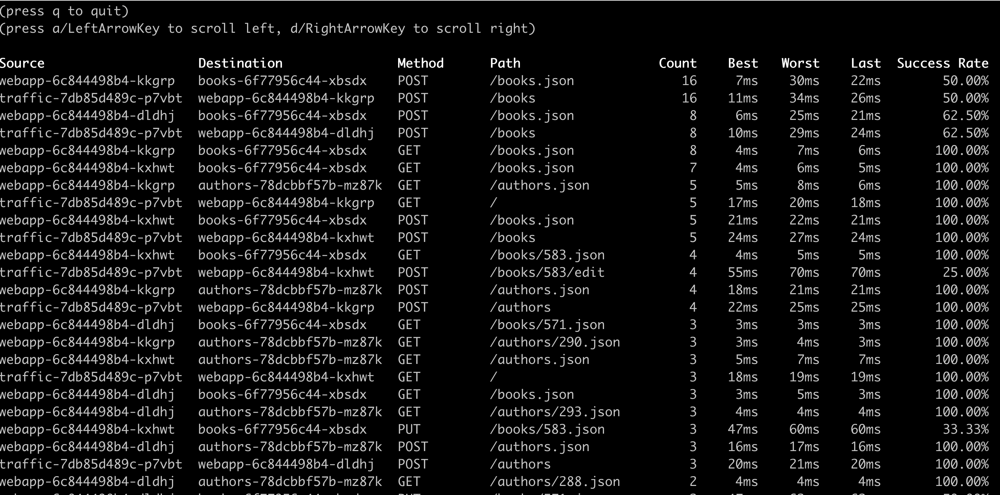
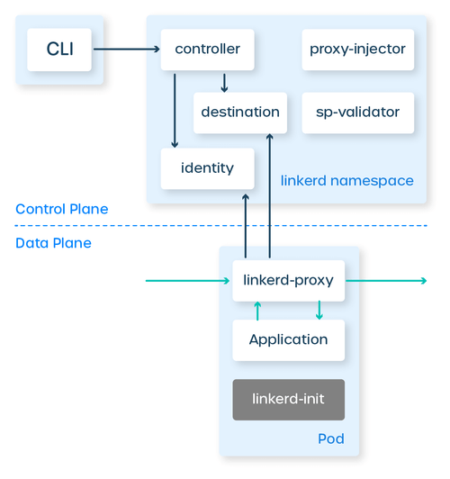

#  linkerd

##  Some doings

### Installing booksapp

```shell
kubectl create namespace booksapp
kubectl annotate ns booksapp linkerd.io/inject=enabled
curl --proto '=https' --tlsv1.2 -sSfL https://run.linkerd.io/booksapp.yml     | kubectl apply -n booksapp -f -
kubectl wait --timeout=5m -n booksapp deployment --all --for=condition=Available
kubectl get pods -n booksapp
```

### linkerd viz stat

```shell
vm@control-plane-01:~$ linkerd viz stat namespace
NAME          MESHED   SUCCESS       RPS   LATENCY_P50   LATENCY_P95   LATENCY_P99   TCP_CONN
booksapp         6/6    80.00%   26.0rps           6ms          59ms          92ms         29
emojivoto        4/4    95.68%    6.2rps           1ms           3ms           4ms         10
linkerd          3/3   100.00%    3.0rps           1ms           2ms           3ms         55
linkerd-viz      5/5   100.00%    2.9rps           1ms           4ms           9ms         23
vm@control-plane-01:~$ linkerd viz stat deployment -n emojivoto
NAME       MESHED   SUCCESS      RPS   LATENCY_P50   LATENCY_P95   LATENCY_P99   TCP_CONN
emoji         1/1   100.00%   2.3rps           1ms           1ms           1ms          3
vote-bot      1/1   100.00%   0.3rps           1ms           2ms           2ms          1
voting        1/1    92.31%   1.3rps           1ms           1ms           1ms          3
web           1/1    96.32%   2.3rps           3ms           4ms           4ms          3
vm@control-plane-01:~$ linkerd viz stat service -n emojivoto
NAME         MESHED   SUCCESS      RPS   LATENCY_P50   LATENCY_P95   LATENCY_P99   TCP_CONN
emoji-svc         -   100.00%   2.0rps           1ms           2ms           4ms          1
voting-svc        -    86.67%   1.0rps           1ms           1ms           2ms          1
web-svc           -    93.33%   2.0rps           3ms           4ms           5ms          1
```

###  Golden Metrics with Linkerd: Latency

```shell
vm@control-plane-01:~$ linkerd viz stat namespace
NAME          MESHED   SUCCESS       RPS   LATENCY_P50   LATENCY_P95   LATENCY_P99   TCP_CONN
booksapp         6/6    80.01%   26.4rps           7ms          68ms          94ms         29
emojivoto        4/4    95.15%    6.2rps           1ms           4ms           4ms         10
linkerd          3/3   100.00%    2.5rps           1ms           2ms           4ms         55
linkerd-viz      5/5   100.00%    2.9rps           1ms           3ms           9ms         23
```

###  Basic observability with linkerd

```shell
vm@control-plane-01:~$ linkerd viz stat deployment -n emojivoto
NAME       MESHED   SUCCESS      RPS   LATENCY_P50   LATENCY_P95   LATENCY_P99   TCP_CONN
emoji         1/1   100.00%   2.3rps           1ms           1ms           2ms          3
vote-bot      1/1   100.00%   0.3rps           1ms           4ms           4ms          1
voting        1/1    79.22%   1.3rps           1ms           1ms           1ms          3
web           1/1    86.96%   2.3rps           3ms           4ms           4ms          3
```

```shell
linkerd viz top -n booksapp deployment/webapp
```



##  Installing

- Install CLI

```shell
curl --proto '=https' --tlsv1.2 -sSfL https://run.linkerd.io/install-edge | sh
```

- Add to path

```shell
export PATH=$HOME/.linkerd2/bin:$PATH

```

- Check the version

```shell
linkerd version
linkerd check --pre
```

- Install CRDs reequired
  
```shell
kubectl apply -f <https://github.com/kubernetes-sigs/gateway-api/releases/download/v1.2.0/experimental-install.yaml>
linkerd install --crds | kubectl apply -f -
```

- Install  CRDs

```shell
linkerd install --crds | kubectl apply -f -

```

```shell
linkerd install | kubectl apply -f -
```

```shell
linkerd check

```

```shell
linkerd install viz

```

```shell
curl --proto '=https' --tlsv1.2 -sSfL <https://run.linkerd.io/emojivoto.yml>   | kubectl apply -f -
kubectl -n emojivoto port-forward svc/web-svc 8080:80
kubectl get -n emojivoto deploy -o yaml   | linkerd inject -   | kubectl apply -f -
linkerd -n emojivoto check --proxy
```

- install the on-cluster metrics stack
-

```shell
linkerd viz install | kubectl apply -f 

```

```shell
linkerd viz dashboard &

```

##  Concepts

### Proxy injector

Now that emojivoto is installed, we need to actually mesh it. Let's take a look under the hood of how we accomplish this using Kubernetes primitives.

Earlier we learned that a sidecar is simply something that is deployed "beside" an application. To be more specific, a sidecar in Kubernetes is an additional container added inside the same Pod as the application container. Since it's part of the same Pod, the sidecar acts just like any other part of the application.

When meshing an application with Linkerd, the sidecar is the Linkerd proxy: it intercepts all traffic to and from the application container in order to mediate and measure all communications in the application.

The application container itself is the primary one in the pod.

Note that the term sidecar simply refers to the pattern. Kubernetes does not actually treat these containers in any special way (though it might, in a future version!).

How does the sidecar container receive all traffic to and from the pod? The answer is that meshing an application also adds an init container to the pod. Init containers are special in Kubernetes—they are guaranteed to be run before the other containers are run. The service mesh's init container sets up the networking rules so that all TCP connections to and from the pod go to the sidecar proxy container. This allows the proxy to do its magic.

(One other difference between init containers and sidecar containers is that the init container terminates after it has done its work. The sidecar container, just like the main application container, continues running until the pod itself is terminated.)

Finally, how do the init container and proxy sidecar container get added to pods, based on an annotation? Here we see the true power of Kubernetes. Part of the service mesh's control plane is a proxy injector, which is a type of Kubernetes component called a mutating admission controller. What this means is that it is allowed to to rewrite the manifest of workloads before they hit the cluster. The service mesh's proxy injector watches for the annotations, and when pod is created that should be meshed, it simply adds the init container and sidecar container to the pod manifest.

And that's the magic of the service mesh on Kubernetes: your application doesn't need to know anything about the service mesh, and all you need to do to activate it is to add an annotation. From there, Kubernetes does all the hard work!


