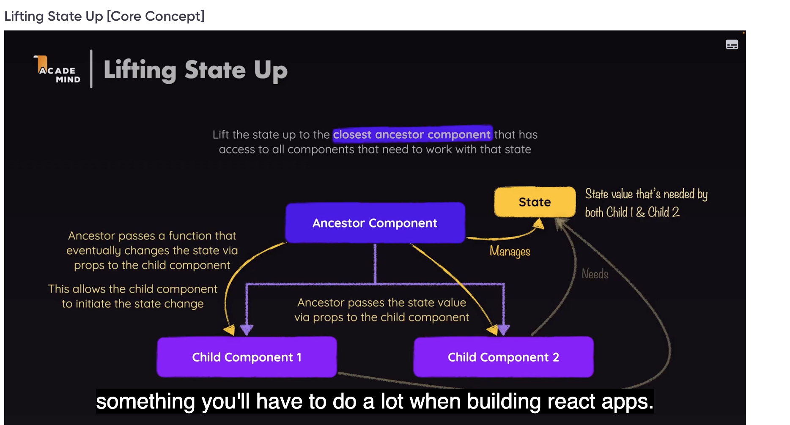

# React / General Concepts

## Roadmap.sh

<https://roadmap.sh/react>

###  Rendering

<https://ui.dev/why-react-renders>

##  HMR (Hot Module Replacement)

Hot Module Replacement ([HMR](https://www.sanity.io/glossary/hot-module-replacement)) is a powerful feature designed to enhance the development process by providing real-time updates to modules within a running application. The beauty of HMR lies in its ability to make these updates without requiring a full page reload, thereby saving valuable time during development.

- HMR from [WebPack](https://webpack.js.org/guides/hot-module-replacement/)

## Lifting state up



## Know these (from ChatGPT)

For working on an enterprise-level project with React, there are several libraries that you should be familiar with. These libraries are commonly used in large-scale applications due to their robustness, flexibility, and community support:

### State Management

1. **Redux**: A robust state management solution that is highly scalable and often used in complex enterprise applications.
   - **Redux Toolkit**: A toolset that simplifies Redux development, making it easier to manage and scale state management.
   - **Redux Saga/Thunk**: Middleware for handling side effects in Redux.

2. **Recoil**: A modern state management library that provides fine-grained control and is designed specifically for React.

3. **MobX**: An alternative to Redux, offering a more flexible and less boilerplate-heavy approach to state management.

### UI Frameworks & Components

1. **Material-UI (MUI)**: A comprehensive UI framework that implements Google’s Material Design, widely used in enterprise apps for consistent and professional UI/UX.

2. **Ant Design**: A robust UI library with extensive components and a design system tailored for enterprise applications.

3. **Chakra UI**: A component library that offers a balance of flexibility and ease of use, with a focus on accessibility.

### Routing

1. **React Router**: Essential for managing navigation and routing in a large-scale React application.

2. **Next.js**: Often used in enterprise projects for server-side rendering, static site generation, and building full-fledged React applications.

### Forms & Validation

1. **Formik**: A powerful form management library that simplifies form validation and submission.

2. **React Hook Form**: A performant and flexible form library that leverages React hooks for more efficient form handling.

3. **Yup**: A schema builder for value parsing and validation, often used in conjunction with Formik or React Hook Form.

### Data Fetching & API Integration

1. **Axios**: A popular library for making HTTP requests, widely used for interacting with REST APIs.

2. **React Query**: An essential tool for managing server-state, caching, and synchronizing remote data, with support for pagination and infinite loading.

3. **Apollo Client**: A powerful library for managing GraphQL queries, mutations, and state.

### Testing

1. **Jest**: The standard testing framework for JavaScript and React, used for unit and integration testing.

2. **React Testing Library**: A tool for testing React components that encourages testing user interactions rather than implementation details.

3. **Cypress**: A robust end-to-end testing framework often used for automated testing in enterprise applications.

### Internationalization (i18n)

1. **React i18next**: A comprehensive internationalization framework that integrates seamlessly with React.

2. **LinguiJS**: A simpler and lightweight alternative for handling translations and internationalization.

### Styling & Theming

1. **Styled Components**: A popular CSS-in-JS library for creating component-level styles with theme support.

2. **Emotion**: Another powerful CSS-in-JS library that offers flexibility and performance in styling React components.

3. **Sass**: A mature CSS preprocessor that provides powerful features for managing styles in large-scale applications.

### Performance Optimization

1. **React.memo**: Built-in React functionality for memoizing components to avoid unnecessary re-renders.

2. **React.lazy & Suspense**: Used for code-splitting and lazy loading components, essential for optimizing performance in large applications.

3. **Recoil**: In addition to state management, Recoil offers fine-grained control over component re-renders, helping optimize performance.

### Accessibility

1. **React Aria**: A library of React hooks that provide accessible UI components with support for keyboard interactions and screen readers.

2. **Reach UI**: A collection of accessible React components that adhere to WAI-ARIA standards.

### Animation

1. **Framer Motion**: A production-ready library for creating complex animations and interactions.

2. **React Spring**: A physics-based animation library that helps create smooth and natural-looking animations.

These libraries will equip you with the tools needed to build, manage, and maintain enterprise-level React applications, ensuring scalability, performance, and maintainability.

##  Know these from Co-pilot

Here are some essential React libraries you should be familiar with for working on an enterprise-level project:

1. **React Router**: For handling routing in your application.
2. **Redux**: For state management, especially in large applications.
3. **Redux Toolkit**: Simplifies Redux development with a set of tools and best practices.
4. **React Query**: For data fetching, caching, and synchronization.
5. **Axios**: For making HTTP requests.
6. **Formik**: For building and managing forms.
7. **Yup**: For form validation.
8. **Styled Components**: For writing CSS in JavaScript.
9. **Material-UI**: A popular React UI framework.
10. **Ant Design**: Another comprehensive UI framework.
11. **React Hook Form**: For managing form state and validation.
12. **Jest**: For testing JavaScript code.
13. **React Testing Library**: For testing React components.
14. **Storybook**: For developing and testing UI components in isolation.
15. **React Helmet**: For managing changes to the document head.
16. **i18next**: For internationalization and localization.
17. **React DnD**: For drag-and-drop functionality.
18. **React Spring**: For animations.
19. **Framer Motion**: Another library for animations.
20. **Recharts**: For building charts and data visualizations.

These libraries cover a wide range of functionalities that are commonly needed in enterprise-level React applications.

"Prop drilling" in React occurs when you have to pass data through many layers of components that do not need it, just to reach a deeply nested component that does. This can make the code harder to manage, understand, and maintain.

## Solutions to Prop Drilling in React

1. **React Context API**:
   - The Context API is a built-in feature of React that provides a way to pass data through the component tree without having to pass props down manually at every level.
   - You create a `Context` object and provide a value at a higher level in the component tree using a `Provider`. Any component within the tree can then access the value via a `Consumer` or the `useContext` hook.
   - This solution is ideal for global state management like themes, user information, or authentication status.

   **Example**:

   ```jsx
   import React, { createContext, useContext, useState } from 'react';

   // Create a Context
   const UserContext = createContext();

   const App = () => {
     const [user, setUser] = useState({ name: 'John Doe' });

     return (
       <UserContext.Provider value={user}>
         <ComponentA />
       </UserContext.Provider>
     );
   };

   const ComponentA = () => <ComponentB />;

   const ComponentB = () => <ComponentC />;

   const ComponentC = () => {
     const user = useContext(UserContext); // Access context value
     return <div>User: {user.name}</div>;
   };
   ```

2. **State Management Libraries (Redux, Zustand, Recoil, etc.)**:
   - For larger applications with complex state management needs, libraries like **Redux**, **MobX**, **Recoil**, or **Zustand** can be used. These libraries provide more advanced state management solutions and allow you to keep your state outside the React component tree.
   - These libraries usually follow a pattern where state is stored in a global store, and any component can subscribe to changes in this state, making it easier to manage and share state across the application.

3. **Component Composition with Render Props or Higher-Order Components (HOCs)**:
   - Using **Render Props** or **Higher-Order Components (HOCs)** is another way to avoid prop drilling by restructuring components so that the data does not need to be passed through intermediate components.
   - **Render Props** allow you to share code between components using a prop whose value is a function, while **HOCs** are functions that take a component and return a new component.

   **Example with Render Props**:

   ```jsx
   const UserProvider = ({ render }) => {
     const user = { name: 'Jane Doe' };
     return render(user);
   };

   const App = () => (
     <UserProvider render={(user) => <ComponentC user={user} />} />
   );

   const ComponentC = ({ user }) => <div>User: {user.name}</div>;
   ```

4. **Custom Hooks**:
   - Creating **custom hooks** can also be a good solution to avoid prop drilling. You encapsulate state management logic in custom hooks, which can then be used by any component that needs the data.

   **Example**:

   ```jsx
   import React, { useState, useContext, createContext } from 'react';

   const UserContext = createContext();

   const useUser = () => useContext(UserContext);

   const UserProvider = ({ children }) => {
     const [user, setUser] = useState({ name: 'Jane Doe' });
     return (
       <UserContext.Provider value={user}>{children}</UserContext.Provider>
     );
   };

   const ComponentC = () => {
     const user = useUser();
     return <div>User: {user.name}</div>;
   };

   const App = () => (
     <UserProvider>
       <ComponentC />
     </UserProvider>
   );
   ```

### Choosing the Right Solution

- **Context API** is great for simple, app-wide state needs and is built into React.
- **State Management Libraries** are suited for complex applications with many moving parts or when needing advanced features like middleware or time travel.
- **Render Props and HOCs** offer flexibility but can result in "wrapper hell" or complex component hierarchies.
- **Custom Hooks** offer a clean and composable way to manage state and logic, especially in function components.

Would you like to dive deeper into any of these solutions?
