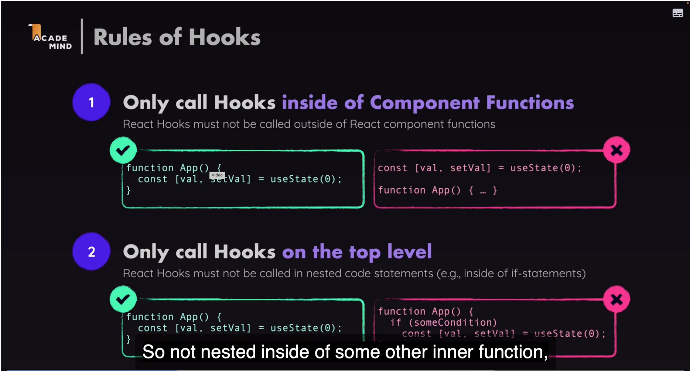
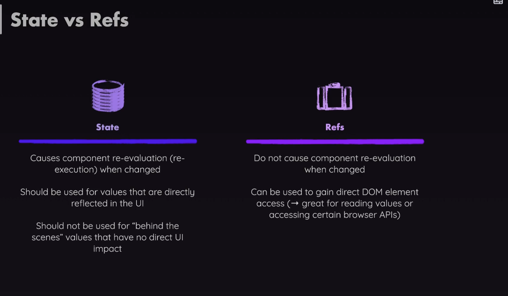

# React Hooks

## Rules

## useEffect

## useCallback

## useState

[useState](https://react.dev/reference/react/useState) is a React Hook that lets you add a state variable to your component.

## useRef

<https://ru.react.dev/reference/react/useRef>

- Start/Stop Watch timer

## useImperativeHandle

## forwardRef

## useContext

Provider, Consumer (it is used rarely as it was told)

## useReducer

<https://onurdayibasi.com/react-hooks/>

/Users/bulent/git-repos/elearning/oreilly-courses/react/rtcg/react-complete-guide-course-resources/code/10 Advanced State Management with Context useReducer/09-dispatching-actions-finished

<https://learnreactui.dev/contents?language=EN>
