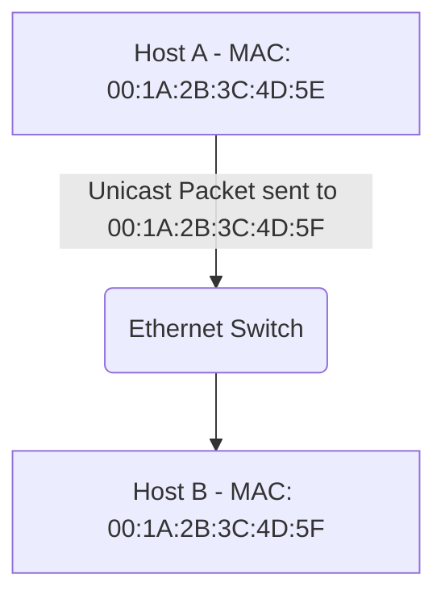
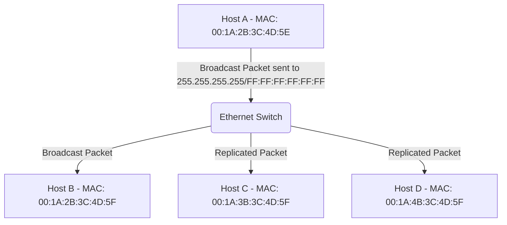
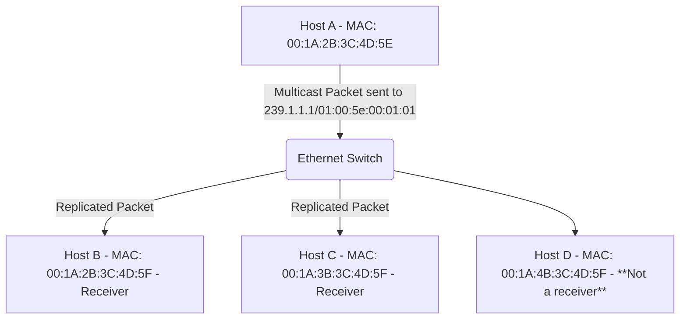
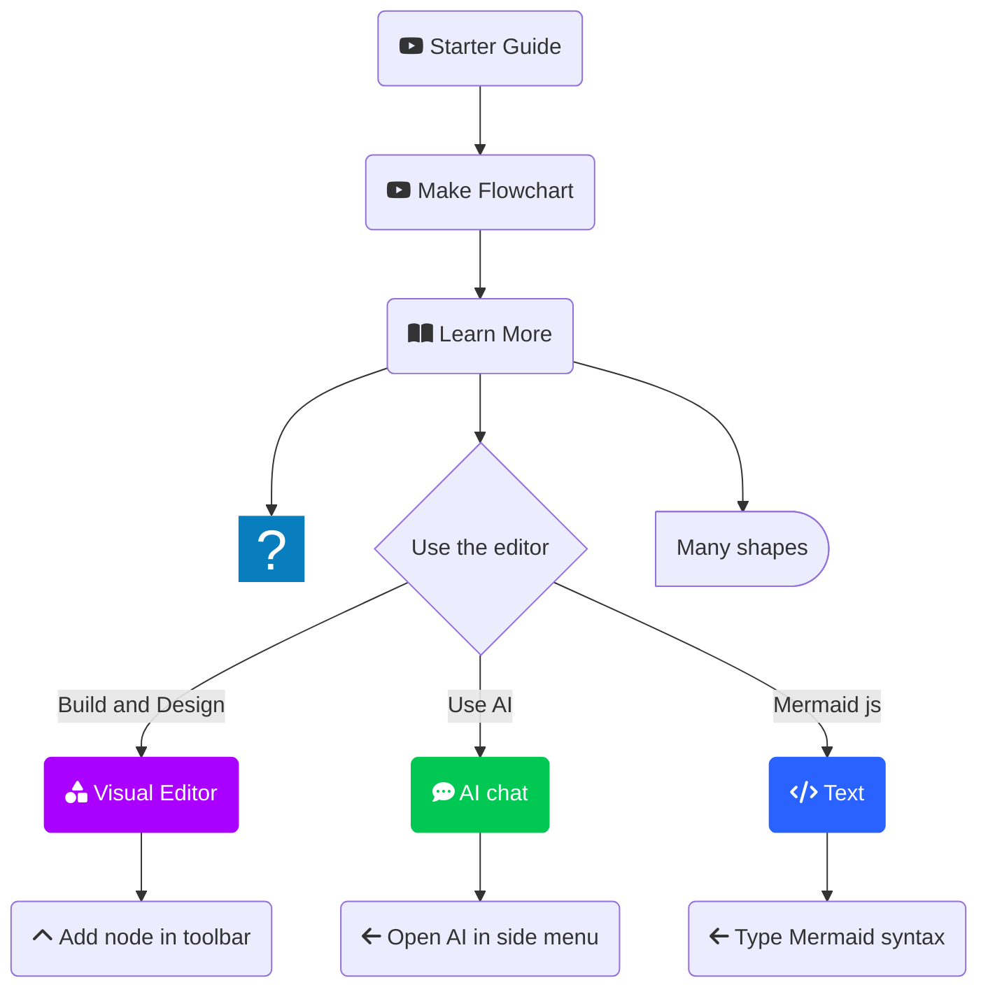
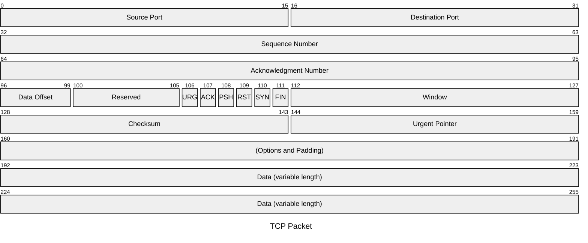

# Mermaid Examples

##  Unicast

```mermaid
flowchart TD
    A[Host A - MAC: 00:1A:2B:3C:4D:5E] --> |Unicast Packet sent to 00:1A:2B:3C:4D:5F| Switch(Ethernet Switch)
    Switch --> B[Host B - MAC: 00:1A:2B:3C:4D:5F] 
```

## Broadcast

```mermaid
flowchart TD
    A[Host A - MAC: 00:1A:2B:3C:4D:5E] --> |Broadcast Packet sent to 255.255.255.255/FF:FF:FF:FF:FF:FF| Switch(Ethernet Switch)
    Switch --> |Broadcast Packet| B[Host B - MAC: 00:1A:2B:3C:4D:5F] 
    Switch --> |Replicated Packet| C[Host C - MAC: 00:1A:3B:3C:4D:5F] 
    Switch --> |Replicated Packet| D[Host D - MAC: 00:1A:4B:3C:4D:5F] 


```

## Multicast

```mermaid
flowchart TD
    A[Host A - MAC: 00:1A:2B:3C:4D:5E] --> |Multicast Packet sent to 239.1.1.1/01:00:5e:00:01:01| Switch(Ethernet Switch)
    Switch --> |Replicated Packet| B[Host B - MAC: 00:1A:2B:3C:4D:5F - Receiver ] 
    Switch --> |Replicated Packet| C[Host C - MAC: 00:1A:3B:3C:4D:5F - Receiver] 
    Switch -->  D[Host D - MAC: 00:1A:4B:3C:4D:5F - **Not a receiver**] 


```

##  Sample Mermaidchart

```mermaid
flowchart TD
%% Nodes
    A("fab:fa-youtube Starter Guide")
    B("fab:fa-youtube Make Flowchart")
    n1@{ icon: "fa:gem", pos: "b", h: 24}
    C("fa:fa-book-open Learn More")
    D{"Use the editor"}
    n2(Many shapes)@{ shape: delay}
    E(fa:fa-shapes Visual Editor)
    F("fa:fa-chevron-up Add node in toolbar")
    G("fa:fa-comment-dots AI chat")
    H("fa:fa-arrow-left Open AI in side menu")
    I("fa:fa-code Text")
    J(fa:fa-arrow-left Type Mermaid syntax)

%% Edge connections between nodes
    A --> B --> C --> n1 & D & n2
    D -- Build and Design --> E --> F
    D -- Use AI --> G --> H
    D -- Mermaid js --> I --> J

%% Individual node styling. Try the visual editor toolbar for easier styling!
    style E color:#FFFFFF, fill:#AA00FF, stroke:#AA00FF
    style G color:#FFFFFF, stroke:#00C853, fill:#00C853
    style I color:#FFFFFF, stroke:#2962FF, fill:#2962FF

%% You can add notes with two "%" signs in a row!
```

##  Sample Packet

```mermaid
---
title: "TCP Packet"
---
packet-beta
0-15: "Source Port"
16-31: "Destination Port"
32-63: "Sequence Number"
64-95: "Acknowledgment Number"
96-99: "Data Offset"
100-105: "Reserved"
106: "URG"
107: "ACK"
108: "PSH"
109: "RST"
110: "SYN"
111: "FIN"
112-127: "Window"
128-143: "Checksum"
144-159: "Urgent Pointer"
160-191: "(Options and Padding)"
192-255: "Data (variable length)"

```
