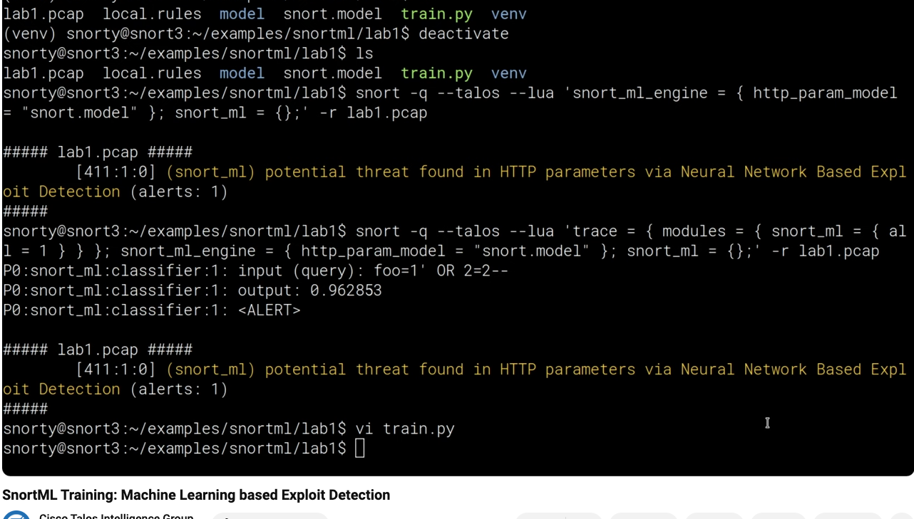

# IDS/IPS

## Snort

- [Snort3 Container](https://hub.docker.com/r/ciscotalos/snort3)
- [An unofficial snort container from Mike Horn](https://github.com/MikeHorn-git/docker-snort3)

###  Snort3 Demo

[A containerized Demo](https://](<https://github.com/snort3/snort3_demo.git>)

```shell title='Demo Run Commands'
brew install bats
brew install pkg-config

./run_test.sh /opt/homebrew/Cellar/snort/3.3.2.0
```

### Running SnortML example

###  Native

- Run the container first and open a bash shell

```shell
git clone https://github.com/snort3/libml.git

```

- Follow README.md.
- Compiled and build.
- and then? Bakmak gerekiyor.

###  In a virtual env

```shell
python3 -m venv env
source env/bin/activate
pip install tensorflow

./train.py
deactivate
```

- model file is build

```shell
snort -q --talos --lua 'snort_ml_engine= { http_param_model = "snort_model" }; snort_ml = {};' -r ~bulent/Desktop/dumps/filtered-file.pcap

```



##  Suricata

[Home](https://suricata.io/)
